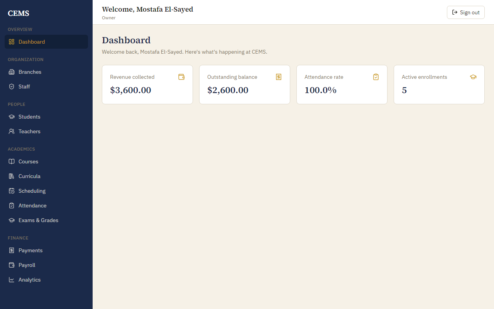
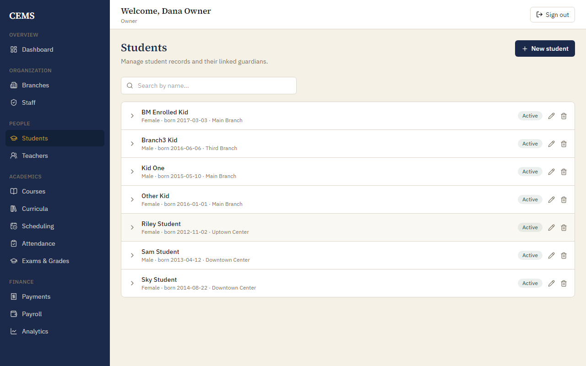
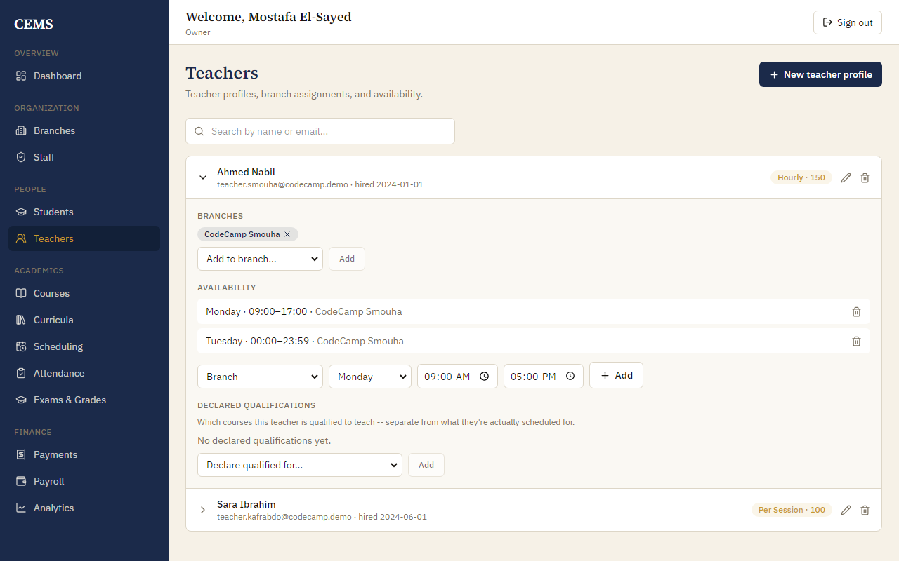
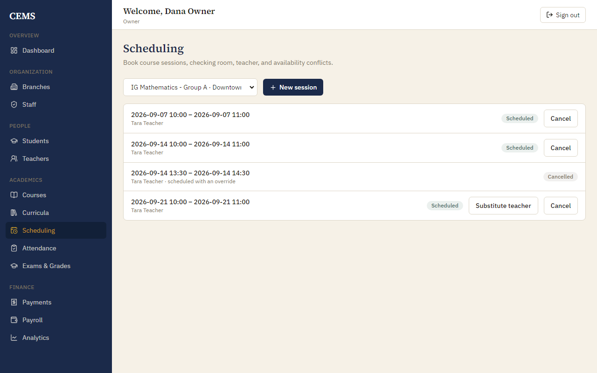
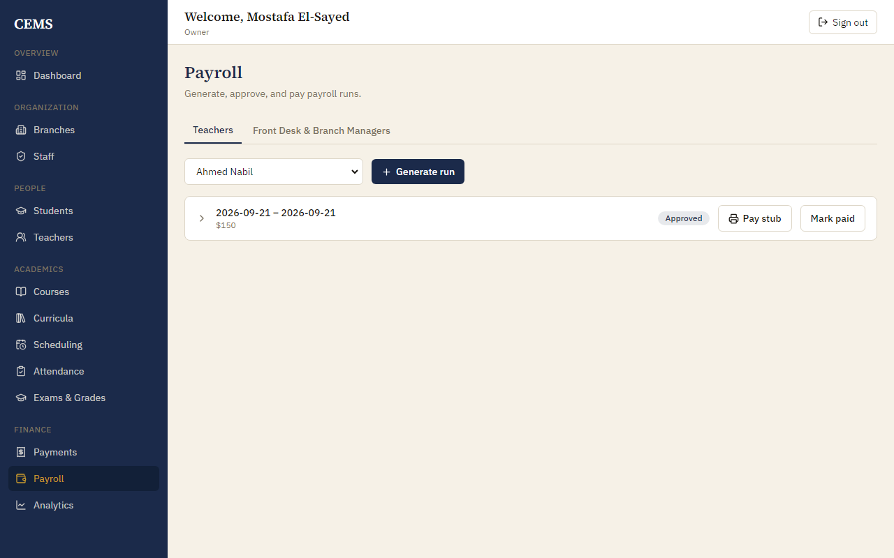
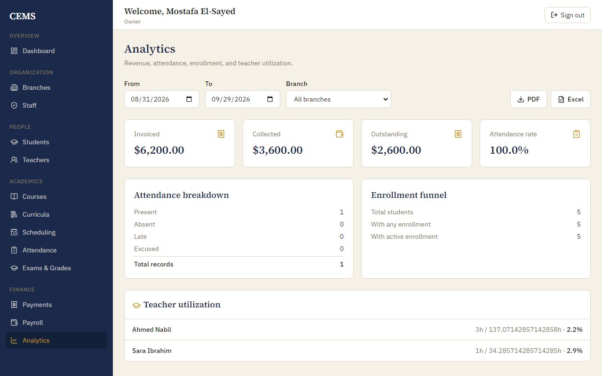
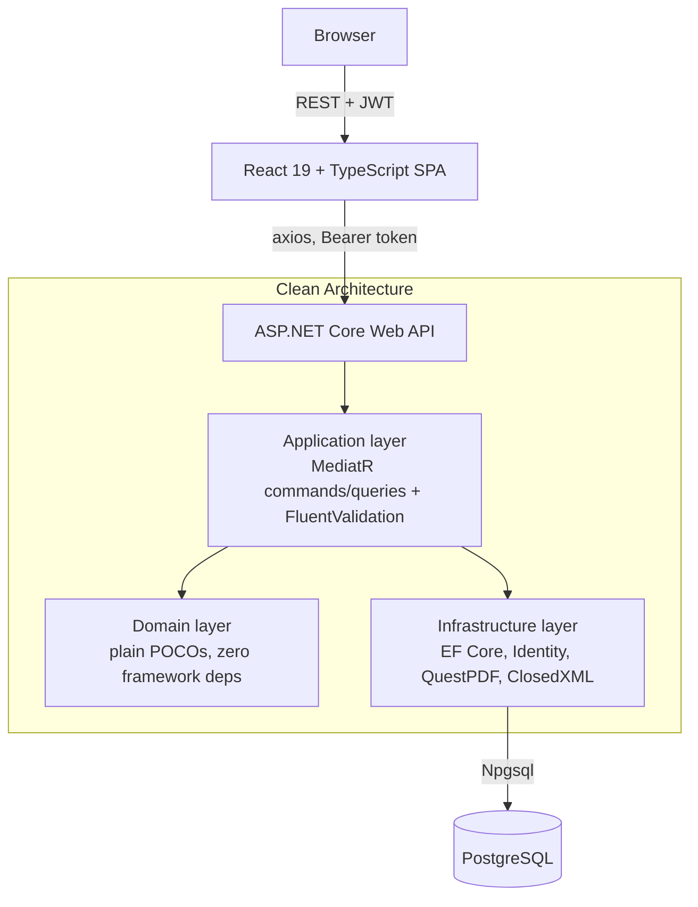
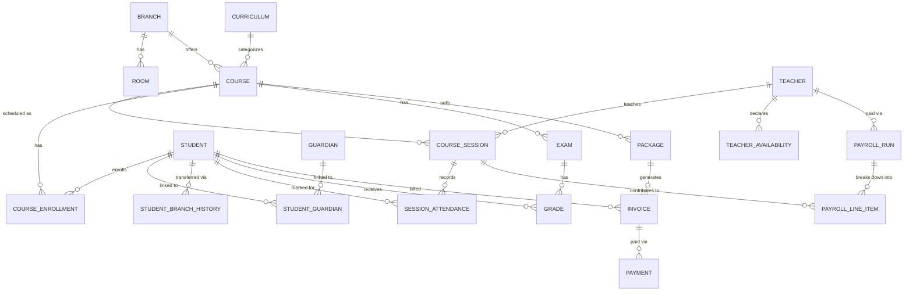

# CEMS

A full-stack management system for a multi-branch educational center — branches and rooms, teachers, students and guardians, courses tied to curricula, scheduled sessions with automatic conflict detection, attendance, exams and grades, invoicing and payments, and payroll computed across four different compensation models. Every non-Owner request is scoped to the caller's own branch at the data-access level, not just hidden in the UI.

      [](https://github.com/alieldeenahmed/CEMS/actions/workflows/ci.yml)

## Screenshots

<table>
<tr>
<td width="50%"><br/><sub>Owner dashboard — revenue, attendance, and enrollment at a glance</sub></td>
<td width="50%"><br/><sub>Students — branch-scoped roster</sub></td>
</tr>
<tr>
<td width="50%"><br/><sub>Teacher profile — branch assignment, availability, declared qualifications</sub></td>
<td width="50%"><br/><sub>Scheduling — booked sessions with a live teacher substitution</sub></td>
</tr>
<tr>
<td width="50%"><br/><sub>Payroll — generated runs, draft and approved</sub></td>
<td width="50%"><br/><sub>Analytics — revenue, attendance, and teacher utilization</sub></td>
</tr>
</table>

## Overview

CEMS is built around one real operating model: an educational center that runs more than one physical branch, employs teachers who may float between branches, and has staff whose visibility must stay inside their own branch — an Owner sees everything, a Branch Manager sees only their branch, front-desk staff run billing and enrollment for their branch, and teachers see only what they teach.

That constraint is what makes the system non-trivial. It isn't a CRUD demo with a role field bolted on: branch scoping is checked inside the handlers that touch branch-owned data (each one calls `HasAccessToBranch` explicitly), scheduling has to detect real conflicts (room double-booking, teacher double-booking, declared-availability violations) before a session is allowed to exist, and payroll has to compute correctly across four genuinely different compensation formulas rather than one calculation with a multiplier.

## Key Features

### 🏢 Multi-Branch Operations
- Every non-Owner request is scoped to the caller's own branch(es) at the query/handler level (`ICurrentUserService.HasAccessToBranch`), reading branch membership from JWT claims — not a client-side filter
- Teachers are **floating**: a `TeacherBranch` join table lets one teacher be assigned to multiple branches, each with its own declared availability
- Branch Managers get a branch-scoped staff roster (`GET /users/staff/my-branch`) that a Teacher's own branch — resolved from their `TeacherBranch` record, not the general `UserBranchAssignment` table used by BranchManager/FrontDesk — has to be looked up correctly for password resets and access checks
- `TeacherCourseQualification` declares which courses a teacher may teach, and scheduling enforces it: a teacher who is not qualified for the course cannot be booked into a session or substituted into one, and no override can waive that (it is a structural rule, like the teacher being assigned to the branch)

### 👥 Student & Academic Management
- **Branch transfer with history**: `POST /students/{id}/transfer-branch` updates the student's current branch and writes an immutable `StudentBranchHistory` row (from, to, date, reason, who did it) — access to the student moves to the new branch's manager immediately
- A student can't be created without a guardian attached — `CreateStudentCommand` accepts either an existing guardian or new-guardian details, and both the guardian and the link are written in one transaction
- Guardians are plain contact records with no login of their own — there is no parent-facing portal
- Report cards render as real PDFs (`IReportCardGenerator` → `QuestPdfReportCardGenerator`), grouped by course

### 📅 Scheduling
- `CreateSessionCommandHandler` checks three independent conflict types before allowing a session: room double-booking, teacher double-booking, and the session falling outside the teacher's declared `TeacherAvailability` window for that branch
- Conflicts are split into **structural** (room/branch mismatch, teacher not assigned to the branch, teacher not qualified for the course — never overridable) and **conflict checks** (double-booking, availability — overridable only by Owner/BranchManager, and only with a required `OverrideReason` that's persisted on the session)
- A detected, non-overridden conflict throws a dedicated `SchedulingConflictException`, mapped by the global exception handler to `409 Conflict` with the specific conflict list in the response body
- **Concurrent bookings can't double-book.** Creating a session and substituting a teacher are check-then-write sequences, so each takes a PostgreSQL advisory lock on the room and teacher involved before checking, and the database refuses overlapping ordinary sessions outright with `EXCLUDE USING gist` constraints (see *Engineering Decisions*). A session that a manager knowingly overrides is exempt, and says so on the row
- `POST /sessions/{id}/substitute-teacher` reassigns an already-scheduled session to a different teacher in place, running the exact same conflict/override logic as creating one (one shared `SessionRules` class, so the two can't drift) — blocked for a cancelled or already-started session. A substitution never erases an earlier override: reasons accumulate on the session
- `TeacherId` lives on the **session**, not the course, so one course can already be split across multiple teachers/groups with no schema change

### 📚 Enrollment & Capacity
- Course capacity is derived, not stored: `EnrollStudentCommandHandler` reads the room capacity of the course's *earliest non-cancelled session* — a course with no sessions yet has no known capacity, so enrollment is unconstrained until one exists
- A student enrolling into a full course is placed on a waitlist (`CourseEnrollmentStatus.Waitlisted`) with a computed `Position`; promotion off the waitlist is a manual action, not automatic
- Enrollment is blocked if the student's branch doesn't match the course's branch, and a student can't be double-enrolled or double-waitlisted in the same course

### 💰 Billing & Payments
- `Invoice.Status` (Pending → PartiallyPaid → Paid) is recalculated automatically every time a `Payment` is recorded, by summing all payments against the invoice amount — not set manually by the client
- Invoices are either package-based (amount taken from `Package.Price`) or ad-hoc (client-supplied amount), and are immutable after creation
- Cancelling an invoice is Owner/BranchManager-only and blocked once it's fully paid
- A dedicated outstanding-balance endpoint sums unpaid amounts across all non-cancelled invoices for a student

### 💵 Payroll
- `GeneratePayrollRunCommandHandler` branches on `Teacher.PayType` with four **genuinely different** calculations, not one formula with a multiplier:
  - **Hourly** — rate × session duration, summed per non-cancelled session in the period, one `PayrollLineItem` per session
  - **PerSession** — a flat rate per session, same per-session line items
  - **Fixed** — a flat salary for the period regardless of sessions held, no line items
  - **Percentage** — a cut of whatever `Payment`s were actually collected (not invoiced) in the period against packages on courses the teacher teaches, no line items
- A cancelled session isn't paid; its linked makeup session is a normal session and is paid like any other
- Guards against generating two overlapping-period runs for the same teacher
- A parallel `StaffPayrollRun` model gives FrontDesk/BranchManager a flat, manually-entered amount (Owner-editable while still Draft) since they have no sessions to compute from
- Every run — teacher or staff — prints as a real PDF pay stub (`IPayStubGenerator` → `QuestPdfPayStubGenerator`)

### 🔐 Security & Authorization
- JWT Bearer auth (`ASP.NET Identity` + `AddJwtBearer`) with issuer/audience/lifetime validation and zero clock skew. The token names who you are; **on every request the API re-reads the account**, so a deactivated account is locked out immediately and the roles and branches used for authorization are the account's current ones, not those frozen into the token. Five wrong passwords lock an account for 15 minutes
- Two-layer RBAC: broad `[Authorize(Roles = ...)]` at the controller, and a precise `HasAccessToBranch(branchId)` check inside the handler for the specific record being touched
- A global `IExceptionHandler` (`GlobalExceptionHandler`) centralizes every failure mode — validation, not-found, forbidden, scheduling conflict — into a consistent `ProblemDetails` response carrying a `traceId`, so no controller has its own try/catch
- Admin-assisted password reset (`POST /users/staff/{id}/reset-password`) with the same branch/role boundary as staff creation — no email involved

### 📊 Reporting & Analytics
- Cross-branch or single-branch revenue, teacher utilization (scheduled vs. available hours), attendance trends, and an enrollment funnel (total → any enrollment → active enrollment)
- Exports to real PDF (QuestPDF) and Excel (`ExportDashboardExcelQuery` → ClosedXML), not a client-side print dialog

### 🔍 Observability
- A MediatR pipeline behavior (`AuditLoggingBehavior`) writes one structured log line per state-changing command — who ran it (user id and roles), which command, success or failure, and duration. It logs the command's type name only, never its payload, so passwords can't leak into logs; queries are skipped to keep read traffic quiet
- `GlobalExceptionHandler` logs expected rejections (400/401/403/404/409) at Information and only genuine 500s at Error with the full exception, and adds a `traceId` to every error response so a user's report can be matched to the exact log entry
- Framework log noise is tuned down in `appsettings.json` (EF Core per-query SQL and the framework's duplicate "unhandled exception" entry for already-handled errors), so the meaningful lines stay visible

## Architecture



The backend is a 4-project Clean Architecture solution — `CEMS.Domain` → `CEMS.Application` → `CEMS.Infrastructure` → `CEMS.Api` — with a strict dependency direction: `Domain` has no framework references at all, and `Application` depends only on `Domain` plus its own abstractions (`IApplicationDbContext`, `ICurrentUserService`, `IIdentityService`), which `Infrastructure` implements. `ApplicationUser` (ASP.NET Identity) lives in `Infrastructure`, not `Domain`; domain entities that need to reference a user store a plain `Guid UserId` instead of a navigation property, so `Domain` never depends on Identity.

Every request goes through MediatR: 16 controllers dispatch to 114 command/query handlers, each with its own FluentValidation validator (34 validator classes) wired in through DI. `ApplicationDbContext` applies a global EF Core `ValueConverter` that forces every `DateTime` to `DateTimeKind.Utc`, since Npgsql rejects `Kind=Unspecified` for `timestamptz` columns and JSON-deserialized timestamps otherwise come back unspecified.

## Domain & Business Logic

The interesting part of this system isn't the entities — it's the rules layered on top of them.

**Scheduling conflicts** are computed, not stored: `CreateSessionCommandHandler` runs three independent checks (room, teacher, teacher-availability) against `CourseSession` and `TeacherAvailability` on every create, under a per-room/per-teacher lock, distinguishes which conflicts are structurally impossible to override (including a teacher who is not qualified for the course) from which can be overridden by an Owner/BranchManager with a recorded reason, and persists that override decision (`Overridden`, `OverrideReason`, `OverriddenByUserId`) on the session itself for audit purposes.

**Branch isolation** isn't a query filter bolted onto the DbContext — it's an explicit check (`_currentUser.HasAccessToBranch(...)`) inside each handler that touches branch-owned data, which means a handler can apply different logic depending on *why* access is being checked: `ResetStaffPasswordCommandHandler`, for instance, has to resolve a Teacher's branch from `TeacherBranch` specifically, because `UserBranchAssignment` (used for BranchManager/FrontDesk) is always empty for a Teacher — a distinction covered by a dedicated regression test (see Testing).

**Payroll** models compensation as a discriminated calculation, not a single formula: two of the four `PayType`s (Hourly, PerSession) build a list of `PayrollLineItem`s from actual `CourseSession` rows in the period; the other two (Fixed, Percentage) compute a total with no session loop at all, because a flat salary and a percentage of collected revenue don't have "line items" in any meaningful sense.

**Invoice/payment state** is derived, not set: recording a `Payment` re-sums every payment against the invoice on every write and recomputes `Pending → PartiallyPaid → Paid` from that sum — there's no code path that lets a client set an invoice's status directly.

## Database Design

PostgreSQL via EF Core 9 / Npgsql, 18 migrations, 21 domain entities across 8 modules (Branches, Students, Teachers, Courses, Attendance, Exams, Payments, Payroll). Beyond primary keys the database enforces invariants directly: one attendance record per student per session, one grade per student per exam, one teacher profile per user, one *live* (active or waitlisted) enrollment per student per course (a dropped one may coexist, which is how re-enrolling works), unique waitlist positions per course, `EXCLUDE USING gist` constraints that stop overlapping ordinary sessions for a room or teacher and overlapping payroll periods for a teacher or staff member, and check constraints for positive amounts, ordered periods and end-after-start sessions.



## API

16 controllers, ~114 endpoints. Grouped by domain:

| Area | Endpoints | Representative examples |
|---|---|---|
| Auth | 2 | `POST /api/auth/login`, `POST /api/auth/bootstrap-owner` (self-disables once any user exists) |
| Students & Guardians | 21 | CRUD, `POST /students/{id}/transfer-branch`, `GET /students/{id}/branch-history`, `GET /students/{id}/report-card`, invoices, balance |
| Teachers | 19 | CRUD, branch assignment, availability, declared qualifications, `GET /teachers/my-schedule`, payroll runs |
| Branches & Rooms | 10 | CRUD branches, CRUD rooms per branch |
| Courses & Curricula | 15 | CRUD, enrollments, waitlist promotion, packages |
| Scheduling | 7 | create/cancel session, `POST /sessions/{id}/substitute-teacher`, attendance |
| Exams & Grades | 7 | CRUD exams, record/view grades |
| Billing | 9 | invoices, `POST /invoices/{id}/payments`, packages |
| Payroll | 9 | generate/approve/mark-paid runs, pay stub PDF, staff payroll runs |
| Analytics | 7 | revenue, attendance trends, enrollment funnel, teacher utilization, PDF/Excel export |
| Staff/Users | 8 | staff CRUD, branch-scoped staff list, password reset |

Swagger/OpenAPI UI is available at `/swagger` in the Development environment (`app.UseSwaggerUI()` in `Program.cs`), with JWT bearer auth wired into the Swagger security scheme.

## Frontend

React 19 + TypeScript, built with Vite. Routing is `react-router-dom`, with a `ProtectedRoute` component gating authenticated routes and redirecting to `/login`; the nav itself (`app/nav.ts`) is role-filtered, so a role that can't call an endpoint doesn't see the page for it — the real enforcement stays server-side.

- **Data fetching**: TanStack Query for every server read/write, with query invalidation on mutation — no separate global store
- **Forms**: React Hook Form + Zod schemas, including cross-field validation (e.g. the create-student guardian rule, a percentage-pay-rate-≤100 refinement that doesn't apply to Hourly)
- **API client**: a single `axios` instance (`shared/api/client.ts`) that attaches the JWT bearer token on every request and clears it on a `401`
- **Structure**: `features/` folders (auth, students, teachers, courses, curricula, scheduling, attendance, exams, payments, payroll, analytics, branches, staff, dashboard) mirror the backend's `Application` module breakdown 1:1; `shared/ui/` holds hand-built primitives (Button, Input, Select, Modal, PageHeader, StatCard, SearchInput) — no external component library
- **Role-aware UI**: pages read the current user's roles (`useAuth().hasRole`) to conditionally show admin-only actions (e.g. only an Owner sees the edit/delete controls on a teacher profile)

## Testing

**525 backend tests and 264 frontend tests.** Merged line coverage is about **98% for the backend** (all three suites together, generated EF migrations excluded) and **98.9% for the frontend** (92% branch). The tests are not padded: they are what found the defects listed below.

**Backend — three xUnit projects, no mocking library.**

| Project | Tests | Database | What it exercises |
|---|---|---|---|
| `CEMS.Application.Tests` | 326 | SQLite in-memory | Every command/query handler family against a real `ApplicationDbContext`, with hand-written fakes for `ICurrentUserService`/`IIdentityService`. Includes the real MediatR pipeline (validation + audit logging), the real ASP.NET Identity/JWT code, and the real QuestPDF/ClosedXML generators. Analytics tests assert hand-computed numbers. |
| `CEMS.Api.Tests` | 157 | SQLite in-memory | The whole HTTP stack through `WebApplicationFactory<Program>`: routing, JWT auth, model binding, exception-to-status mapping, multi-step workflows (enroll → invoice → pay → payroll, waitlist promotion, substitution, password reset) signed in as real users from two branches, and assertions on what is written to the logs. |
| `CEMS.Postgres.Tests` | 42 | **PostgreSQL** | What SQLite can't show: every migration applied to an empty database (and the model checked for un-migrated changes), the exclusion/unique/check constraints, advisory locks, `timestamptz` and `numeric` behaviour, and **genuinely concurrent requests** — handlers and HTTP calls released at the same instant against a real server. |

Three suites do most of the security work:

- **Authorization snapshot** (`authorization-surface.txt`) — a reflected list of every one of the 114 endpoints with its `[Authorize]` roles. Any endpoint added, removed, or re-permissioned fails the test until the diff is reviewed and the snapshot regenerated with `UPDATE_AUTH_SNAPSHOT=1`.
- **Access sweep** — fires a request at every route that takes another resource's id (rooms, courses, enrollments, sessions, students, guardians, invoices, packages, exams, availability, payroll runs…) as a signed-in user who must not reach it — staff of another branch, and a teacher reaching for another teacher's course — and requires 403/404 for all of them. A new endpoint that forgets its scope check shows up here.
- **Role × endpoint matrix and branch-isolation tests** — the same idea from the other direction, per role.

The concurrency tests are meant to be able to fail: with the advisory locks and the exclusion constraints both disabled, six of the ten scheduling-race tests fail; with only the locks disabled, the constraints alone still stop the double-booking and two of the tests fail (concurrent overrides, and overlapping partial slots).

### Running the tests

```bash
dotnet test Backend/CEMS.sln                                       # everything (needs PostgreSQL, see below)
dotnet test Backend/CEMS.sln --filter "FullyQualifiedName!~CEMS.Postgres.Tests"   # the fast, hermetic suites only
cd Frontend && npm run test:coverage
```

`CEMS.Postgres.Tests` needs a PostgreSQL server whose role may `CREATE DATABASE`. It creates a throwaway database per test class and drops it afterwards, and it **fails, rather than skips**, if no server is reachable — so a green run always means PostgreSQL was really exercised. It looks for the server in `CEMS_TEST_POSTGRES` (a normal Npgsql connection string), and otherwise reuses the API's own `dotnet user-secrets` connection (host and credentials only — the database name is replaced), so anyone who can run the app can run the tests. With Docker:

```bash
docker run -d --name cems-pg -e POSTGRES_PASSWORD=postgres -p 5432:5432 postgres:16
export CEMS_TEST_POSTGRES="Host=localhost;Username=postgres;Password=postgres"
```

### Bugs the tests found

All fixed, each with a regression test:

- `RecordPaymentCommandHandler` counted each new payment twice, so a payment over half an invoice marked it fully paid.
- Guardians were readable and editable across branches; visibility is now derived from the guardian's students' branches.
- Deleting a student, room or teacher with history hit a foreign-key error and returned a 500; each now returns a 400 with a reason.
- Attendance could be marked on a cancelled session; admin password reset removed the old password before validating the new one against the policy.
- **Concurrency:** two simultaneous bookings of one room or teacher both succeeded; two simultaneous first-time setups created two Owners; two payments racing on one invoice could overpay it or leave the wrong status; six students enrolling at once could overfill a one-seat course; two payroll runs for the same teacher and period could both be created; an amount edit could land on a payroll run that had just been approved.
- **Atomicity:** creating a staff member wrote the account, its role and its branch assignment as separate commits, so a failure part-way left a login with no branch and a "email already taken" error on retry.
- **Business rules that only the UI enforced:** a payment could exceed the invoice balance or be dated in the future; money with a third decimal place was validated, used in calculations, then silently rounded by the column; hourly payroll totals disagreed with the sum of their rounded line items; an overnight session slipped past the availability check; a substitution wiped an earlier override record; a waitlisted student could be promoted into a full course; a student could be transferred while still enrolled at the old branch; a package from another branch could be used to invoice a student.

## CI/CD

GitHub Actions (`.github/workflows/ci.yml`) runs on every push to `main` and on every pull request, as two parallel jobs:

| Job | Steps |
|---|---|
| Backend | `dotnet restore` → `dotnet build` (Release, whole solution) → `dotnet test` (both test projects) |
| Frontend | `npm ci` → `npm run lint` (oxlint) → `npm run test:coverage` (Vitest, fails below a 90% coverage floor) → `npm run build` (`tsc -b` + Vite) |

The backend job starts a PostgreSQL 16 service container and points `CEMS_TEST_POSTGRES` at it, so the PostgreSQL-only tests (migrations, constraints, advisory locks, real concurrency) run on every push. There is no deployment step — the pipeline validates, it doesn't ship.

## Project Structure

```text
CEMS/
├── Backend/
│   ├── src/
│   │   ├── CEMS.Domain/          # Entities, enums — no framework dependencies
│   │   ├── CEMS.Application/     # MediatR commands/queries, validators, DTOs, interfaces
│   │   ├── CEMS.Infrastructure/  # EF Core, Identity, Postgres, QuestPDF, ClosedXML
│   │   └── CEMS.Api/             # Controllers, JWT/CORS/Swagger setup, exception handling
│   └── tests/
│       ├── CEMS.Application.Tests/   # Handler, pipeline, Identity/JWT, report tests (SQLite)
│       ├── CEMS.Api.Tests/           # HTTP integration, authorization snapshot, access sweep (SQLite)
│       └── CEMS.Postgres.Tests/      # Real PostgreSQL: migrations, constraints, locks, concurrency
├── .github/workflows/            # CI: backend build+test, frontend lint+test+build
├── Frontend/
│   └── src/
│       ├── features/             # One folder per domain module, mirrors Application/
│       ├── shared/                # API client, hand-built UI primitives
│       └── app/                  # Routing, nav, auth context
├── docs/screenshots/
├── scripts/                      # Local backup/restore, demo data seeder
└── README.md
```

## Tech Stack

| Layer | Technology |
|---|---|
| Backend | ASP.NET Core Web API (.NET 9) |
| Language | C# |
| Architecture | Clean Architecture (Domain → Application → Infrastructure → Api) |
| Application layer | CQRS via MediatR, FluentValidation |
| ORM | Entity Framework Core 9 (Npgsql provider) |
| Database | PostgreSQL |
| Auth | ASP.NET Identity + JWT Bearer |
| Docs | Swagger / OpenAPI (Development only) |
| PDF export | QuestPDF |
| Excel export | ClosedXML |
| Backend testing | xUnit; SQLite in-memory for speed, PostgreSQL for what SQLite can't show |
| Frontend | React 19, TypeScript |
| Build tool | Vite |
| Styling | Tailwind CSS v4 |
| Data fetching | TanStack Query |
| Forms/validation | React Hook Form + Zod |
| Routing | React Router |
| Frontend testing | Vitest, React Testing Library |
| Linting | oxlint |

## Getting Started

### Prerequisites
- .NET 9 SDK
- Node.js
- A local PostgreSQL instance

### Configuration

Connection string and JWT signing key are read from configuration and never committed. `Program.cs` fails fast at startup if the connection string is missing or the JWT settings are invalid (key under 32 bytes, missing issuer/audience, or an expiry outside 1 minute–24 hours). Set them locally with .NET's [Secret Manager](https://learn.microsoft.com/aspnet/core/security/app-secrets), from `Backend/src/CEMS.Api`:

```bash
dotnet user-secrets set "ConnectionStrings:Default" "Host=localhost;Port=5432;Database=cems;Username=postgres;Password=YOUR_PASSWORD"
dotnet user-secrets set "Jwt:Key" "<a long random string, at least 32 characters>"
```

Any other environment sets the same values as `ConnectionStrings__Default` / `Jwt__Key` environment variables instead — `IConfiguration` reads both the same way.

### Database

```bash
dotnet ef database update --project Backend/src/CEMS.Infrastructure --startup-project Backend/src/CEMS.Api
```

The migrations create the `btree_gist` extension (trusted since PostgreSQL 13, so the database owner can create it) and add overlap/uniqueness constraints; on a database that already contains rows that violate them (two ordinary sessions overlapping in one room, overlapping payroll periods, duplicate live enrollments) the migration fails and those rows must be resolved first.

There's no self-registration endpoint. The first account is created via `POST /api/auth/bootstrap-owner` (anonymous, but self-disables the instant any user exists):

```bash
curl -X POST https://localhost:7099/api/auth/bootstrap-owner \
  -H "Content-Type: application/json" \
  -d '{"email":"you@example.com","password":"YourPassword123","fullName":"Your Name","phoneNumber":"0100000000"}'
```

Every other account is created afterward via `POST /api/users/staff`.

### Running it

```bash
# Backend — https://localhost:7099 (and http://localhost:5272)
dotnet run --project Backend/src/CEMS.Api

# Frontend — http://localhost:5173
cd Frontend && npm install && npm run dev
```

### Demo data

`scripts/seed-demo-data.ps1` populates a fresh, empty `cems` database by driving the real running API end to end — every row passes through actual password hashing, RBAC, scheduling conflict checks, and payroll computation, not a raw SQL insert.

```powershell
./scripts/seed-demo-data.ps1
```

Prints every seeded account's email at the end (all passwords: `DemoPass123`).

## Engineering Decisions

- **Branch isolation is enforced inside handlers, not just at the controller.** `[Authorize(Roles = ...)]` on a controller only proves a caller *has a role* — it says nothing about *which branch*. Every handler that touches branch-owned data calls `ICurrentUserService.HasAccessToBranch(...)` explicitly, reading branch membership from JWT claims, so the check travels with the specific record being accessed rather than the endpoint being called.
- **Scheduling conflicts get a dedicated exception type and HTTP status**, rather than reusing a generic bad-request. `SchedulingConflictException` carries the specific list of conflicts and maps to `409 Conflict`, letting the frontend distinguish "this input was invalid" from "this input is valid but collides with something."
- **Payroll's four `PayType`s are implemented as genuinely different code paths**, not one formula with a multiplier — because a hard-coded salary and a percentage of collected revenue don't have per-session line items, and forcing them through a shared session-loop would produce meaningless line items just to satisfy a common shape.
- **Invoice status is computed on every payment, never set directly.** The alternative — letting a client pass a status — would let the stored state drift from the actual sum of payments; deriving it from `Payments` on every write means it can't.
- **Domain has zero framework dependencies.** `ApplicationUser` (ASP.NET Identity) lives in `Infrastructure`; a domain entity that needs to reference a user stores a plain `Guid UserId` rather than a navigation property to `ApplicationUser`, keeping `Domain` compilable without any ASP.NET or EF Core reference.
- **Tests run against a real EF Core context, not a mocked one — and where the provider matters, against PostgreSQL itself.** The fast suites build `ApplicationDbContext` on SQLite in-memory instead of mocking `IApplicationDbContext`, because a mock would pass regardless of whether a query translates. SQLite is not PostgreSQL, though (no exclusion constraints, no advisory locks, different `timestamptz` and `numeric` behaviour, single writer), so `CEMS.Postgres.Tests` covers those against a real server.

## Challenges / Interesting Problems

- **Preventing cross-branch data access without duplicating the check everywhere.** The system settles on one method (`HasAccessToBranch`) called explicitly inside each handler at the point where a branch-owned record is loaded, rather than a global query filter — which means a handler like `ResetStaffPasswordCommandHandler` can special-case *how* a branch is resolved (via `TeacherBranch` instead of `UserBranchAssignment`) depending on the target user's role, something a blanket filter couldn't express.
- **Scheduling conflict detection across three independent dimensions at once** (room, teacher, teacher-availability) that must all be checked before a session is allowed to exist, with an override path that has to be gated by role *and* require a persisted reason — while still allowing a substitute-teacher reassignment to reuse the identical logic instead of a parallel implementation.
- **Payroll as a discriminated calculation.** Representing four compensation models cleanly meant accepting that two of them produce audit-trail line items and two don't, rather than forcing a common shape onto all four.
- **Time representation.** Storing every `DateTime` as UTC via a global EF Core value converter, since Npgsql rejects `Kind=Unspecified` against `timestamptz` and a JSON-deserialized timestamp without a `Z` suffix comes back `Unspecified` by default — the converter means the API stays correct even when a client forgets the suffix.

## Engineering Decisions / Trade-offs

**Branch isolation is a convention, backed by tests — not a global filter.** Each handler that touches branch-owned data calls `EnsureAccessToBranch` (or `VisibleTo` for guardians, which have no branch of their own) as soon as it knows the record's branch. A global EF query filter would be harder to forget but cannot express "a teacher's branch comes from `TeacherBranch`, a manager's from `UserBranchAssignment`". The cost of a convention is that it can be forgotten, so it is enforced from outside: the endpoint snapshot fails on any change to who may call what, and the access sweep tries every id-taking route as someone who must not reach it.

**Concurrency: advisory locks first, exclusion constraints behind them.** "Is the room free? then book it" is a race, and `SERIALIZABLE` would mean retry loops on every write path. Instead the handler opens a transaction and takes `pg_advisory_xact_lock` on the room and the teacher (in sorted order, so two requests can't deadlock), and only then checks — the second request waits, then sees the first one's session. Row locks can't do this because the conflicting row doesn't exist yet. Behind the locks, `EXCLUDE USING gist` constraints make the database itself refuse two ordinary sessions that overlap in a room or for a teacher, so a code path that forgets the lock still can't corrupt the timetable. Sessions a manager has knowingly overridden are exempt from the constraint (that's what an override is) and carry their reason on the row. The same lock mechanism serializes enrolling/promoting per course, payments and cancellation per invoice, payroll generation and approval, student transfers, and the one-time Owner bootstrap; unique indexes and payroll-period exclusion constraints are the backstop for those.

**Transactions where the operation is genuinely atomic, not everywhere.** A single `SaveChangesAsync` is already atomic, so most handlers have no explicit transaction. Explicit ones exist only where more than one write or a lock is involved: session booking, enrollment, payments, payroll, transfers, and creating a staff member (Identity account + role + branch assignment share one `DbContext`, so one transaction covers all three). `IApplicationDbContext.AcquireLocksAsync` refuses to run outside a transaction, because an advisory lock taken in autocommit would release immediately and protect nothing.

**Teacher qualification is structural, not overridable.** A conflict (double-booking, outside availability) is something a manager may knowingly accept; an unqualified teacher is not a scheduling collision but a staffing fact, like a teacher who isn't assigned to the branch. The trade-off is that an emergency cover needs the qualification added first (a one-click Manager/Owner action) rather than an override reason.

**The JWT proves identity; the account decides access.** Tokens last up to 6 hours and there is no refresh flow, so on their own a deactivated account or a changed role would linger for hours. Rather than build a revocation list, every request re-reads the account (three small queries) and rejects it if it is gone or deactivated, and rebuilds the role and branch claims from the database. Five failed passwords lock an account for 15 minutes; a locked account answers exactly like a wrong password, at the cost that someone who knows an address can lock that account out.

**Logging is narrow by construction.** Each successful command writes one audit line: who, which command, which records (the values of its `Guid` properties and nothing else, so passwords, emails and amounts cannot reach a log even by mistake), and a trace id. A failed request is logged once, at the HTTP layer, at a level that means something: `Warning` for 401/403 (with user and client address), `Information` for other client errors, `Error` with the exception for a 500. Failed logins log no email and no guess.

**Money is validated to what the column can hold.** Amounts are `numeric(10,2)`; validators reject a third decimal place or an overflow up front (otherwise PostgreSQL would silently round a value the code had already used), payroll rounds each line half-away-from-zero so totals equal the sum of their lines, and check constraints repeat the basics (positive amounts, ordered periods) in the database.

**Two databases in the tests, on purpose.** SQLite in-memory keeps 480+ tests to seconds and lets every test start from an empty database; PostgreSQL is used only for what SQLite cannot show, and those tests fail rather than skip when no server is available.

**The Application layer talks to EF Core directly.** `IApplicationDbContext` exposes `DbSet`s and handlers query them; there is no repository layer on top. That is a deliberate simplification (a repository over EF would mostly rename `Where`), paid for by the Application project depending on EF Core, and it is why the tests run handlers against a real context rather than mocks.

**Some behaviors that look like gaps are decisions.** Teachers are shared across branches, so a Branch Manager may attach any teacher to *their own* branch (they cannot touch another branch). The front desk is not sent teacher pay. A payment may not exceed the remaining balance (there is no customer-credit model), and may not be future-dated.

## Project Status

Actively developed and demo-ready for local evaluation, with CI validating every push. It is a portfolio system, not a hardened production service; known limitations:

- Session scheduling assumes a single timezone across all branches; `TeacherAvailability` and session times are compared as literal UTC day-of-week/time-of-day with no per-branch timezone handling, and an availability window can't describe a session that crosses midnight (such a session is treated as outside availability)
- JWTs last 6 hours (`Jwt:ExpiryMinutes`) with no refresh token — a hard logout at expiry, not a silent renewal — and the per-request account check adds a few database reads to every authenticated call (a cache or a shorter token plus refresh would be the next step at scale)
- No email integration: password resets are admin-assisted rather than self-service, and there are no invoice-due reminders
- Logging goes through the standard `ILogger` to the console only — there is no log sink, metrics, or tracing backend configured
- Percentage-based teacher payroll pays each teacher of a course their percentage of that course's full collected revenue (co-teachers each get a share of the same money), and still counts payments on invoices that were later cancelled while partly paid, which the revenue analytics exclude
- The Owner-only payroll handlers rely on the controller's `[Authorize(Roles = "Owner")]` (pinned by the endpoint snapshot) rather than re-checking the role inside the handler
- A front-desk user can delete a student, but only one with no enrollments, attendance, grades or invoices (mistaken entries); anyone with history must be set to Paused or Graduated
- Deactivating a user takes effect on their next request, but there is no "sign out everywhere" or per-device session list

## License

Licensed under the [MIT License](LICENSE).
