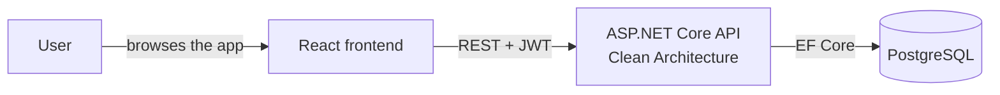

# CEMS — Center Educational Management System

A full-stack management system for a multi-branch educational center — branches and rooms, teachers, students and guardians, courses tied to curricula, scheduled sessions, attendance, exams and grades, payments, and payroll. Every non-Owner request is scoped to the caller's own branch at the API level, and every business rule — scheduling conflicts, payroll computation, invoice status — is enforced server-side, never just hidden in the UI.

    

## Why this exists

I built CEMS to prove I could design a system with real business complexity end to end, not just CRUD screens wrapped in an admin theme. A multi-branch educational center was the right test case: it needed genuine role-based access control (a branch manager should never see another branch's students), scheduling logic that actually resolves room/teacher conflicts instead of just recording bookings, and payroll that computes correctly across four different pay structures. Every feature here ties back to a decision a real Owner, Branch Manager, or Front Desk staff member would need to make day to day.

## What it does

- **Role-based access control enforced server-side** — every non-Owner request is scoped to the caller's own branch(es) at the API/query level, never just a hidden button in the UI
- **Real scheduling conflict detection** — room double-booking, teacher double-booking, and declared-availability conflicts are all checked automatically, with an audited override path for Owner/BranchManager only. Sessions can be reassigned to a substitute teacher in place, running the same conflict checks as creating one
- **Branch transfers with history** — moving a student between branches updates access immediately and keeps an auditable record of every move
- **Billing and payroll that actually compute** — invoices track paid/partial/overdue automatically from recorded payments; payroll runs are computed from real session data across four pay structures (hourly, per-session, fixed, and percentage-of-revenue)
- **PDF/Excel exports** for report cards, pay stubs, and the analytics dashboard
- **Tested where it matters** — backend handler tests run against a real EF Core context (SQLite in-memory, not mocks) so query-translation bugs can't hide behind a mock; frontend tests cover the client-side logic that can break silently

## Architecture



The backend follows Clean Architecture — `Domain` → `Application` → `Infrastructure` → `Api` — with MediatR handling every command/query (CQRS) and FluentValidation on every input. Access control is enforced twice: broadly with `[Authorize(Roles=...)]` at the controller level, and precisely inside each handler via a branch-scoping check, so a request can't leak data across branches no matter which endpoint it hits.

| Role | Scope |
|---|---|
| Owner | Org-wide, full visibility and administration |
| BranchManager | One branch |
| Teacher | One or more branches (floating) |
| FrontDesk | One branch |

## Stack

| | |
|---|---|
| **Backend** | .NET 9 · ASP.NET Core Web API · EF Core + Npgsql · PostgreSQL · ASP.NET Identity + JWT · MediatR (CQRS) · FluentValidation · QuestPDF · ClosedXML · xUnit |
| **Frontend** | React 19 · TypeScript · Vite · Tailwind CSS v4 · TanStack Query · React Hook Form + Zod · Vitest + React Testing Library |

## Screenshots

<table>
<tr>
<td width="50%"><br/><sub>Owner dashboard — revenue, attendance, and enrollment at a glance</sub></td>
<td width="50%"><br/><sub>Students — branch-scoped roster</sub></td>
</tr>
<tr>
<td width="50%"><br/><sub>Teacher profile — branches, availability, declared qualifications</sub></td>
<td width="50%"><br/><sub>Scheduling — sessions with a live teacher substitution</sub></td>
</tr>
<tr>
<td width="50%"><br/><sub>Payroll — generated runs, draft and paid</sub></td>
<td width="50%"><br/><sub>Analytics — revenue, attendance, and teacher utilization</sub></td>
</tr>
</table>

## Structure

```
CEMS/
├── Backend/     # ASP.NET Core API — Domain / Application / Infrastructure / Api
└── Frontend/    # React + TypeScript UI
```

## Getting started

Requires a local PostgreSQL instance and a `cems` database. The connection string and JWT signing key are set via .NET's [Secret Manager](https://learn.microsoft.com/aspnet/core/security/app-secrets), never committed. Run from `Backend/src/CEMS.Api`:

```bash
dotnet user-secrets set "ConnectionStrings:Default" "Host=localhost;Port=5432;Database=cems;Username=postgres;Password=YOUR_PASSWORD"
dotnet user-secrets set "Jwt:Key" "<a long random string, at least 32 characters>"
```

Apply migrations from `Backend/`:

```bash
dotnet ef database update --project src/CEMS.Infrastructure --startup-project src/CEMS.Api
```

There's no self-registration endpoint — every account is created by an Owner or staff member. The one exception is the very first account: `POST /api/auth/bootstrap-owner` is anonymous but self-disables the instant any user exists.

```bash
curl -X POST https://localhost:7099/api/auth/bootstrap-owner \
  -H "Content-Type: application/json" \
  -d '{"email":"you@example.com","password":"YourPassword123","fullName":"Your Name","phoneNumber":"0100000000"}'
```

### Demo data

`scripts/seed-demo-data.ps1` populates a fresh, empty `cems` database with a realistic dataset modeled on a coding school with two branches — teachers, students and guardians, enrollments, scheduled sessions, attendance, a graded exam, invoices in every payment state, and an approved payroll run. It drives the real running API end to end, so every row passes through actual password hashing, RBAC, scheduling conflict checks, and payroll computation.

```powershell
dotnet run --project Backend/src/CEMS.Api
# in another terminal, from the repo root:
./scripts/seed-demo-data.ps1
```

Prints every demo account's email at the end (all passwords: `DemoPass123`).

### Testing

```bash
dotnet test Backend/tests/CEMS.Application.Tests/CEMS.Application.Tests.csproj
cd Frontend && npm test
```

## License

Licensed under the [MIT License](LICENSE).
