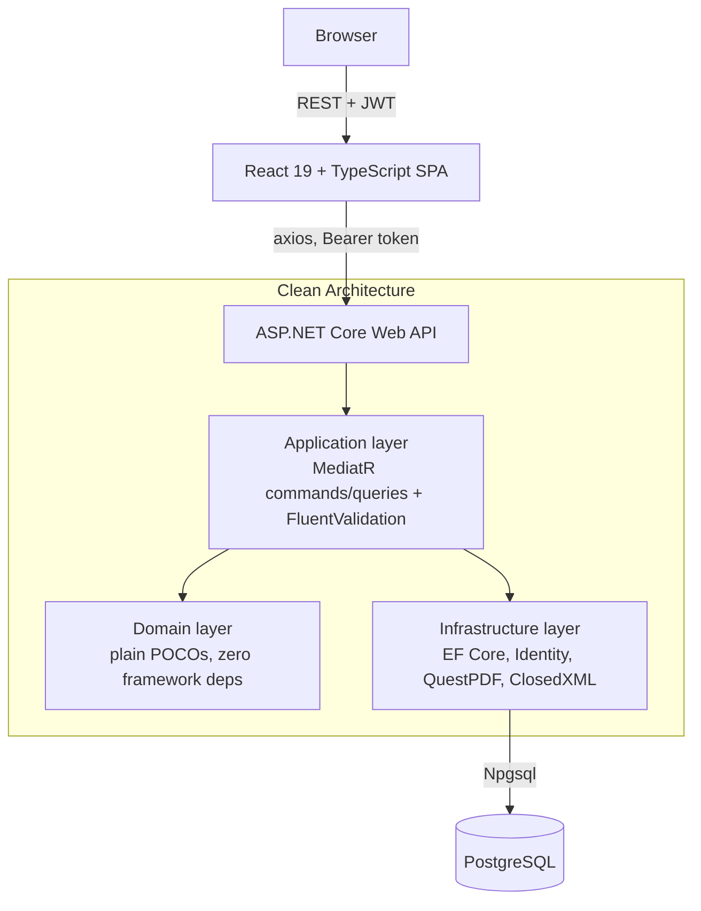
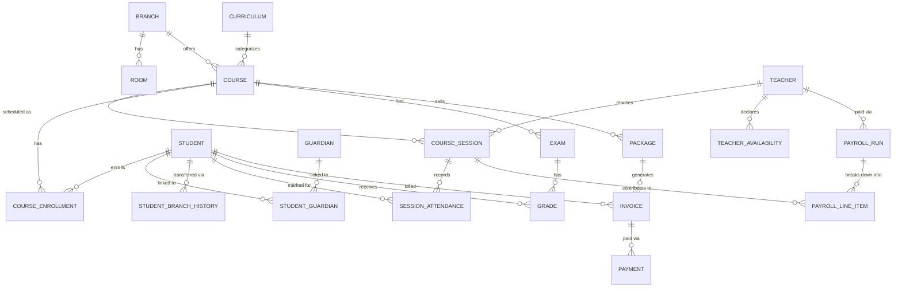

# CEMS

A full-stack management system for a multi-branch educational center — branches and rooms, teachers, students and guardians, courses tied to curricula, scheduled sessions with automatic conflict detection, attendance, exams and grades, invoicing and payments, and payroll computed across four different compensation models. Every non-Owner request is scoped to the caller's own branch at the data-access level, not just hidden in the UI.

     

## Screenshots

<table>
<tr>
<td width="50%"><br/><sub>Owner dashboard — revenue, attendance, and enrollment at a glance</sub></td>
<td width="50%"><br/><sub>Students — branch-scoped roster</sub></td>
</tr>
<tr>
<td width="50%"><br/><sub>Teacher profile — branch assignment, availability, declared qualifications</sub></td>
<td width="50%"><br/><sub>Scheduling — booked sessions with a live teacher substitution</sub></td>
</tr>
<tr>
<td width="50%"><br/><sub>Payroll — generated runs, draft and approved</sub></td>
<td width="50%"><br/><sub>Analytics — revenue, attendance, and teacher utilization</sub></td>
</tr>
</table>

## Overview

CEMS is built around one real operating model: an educational center that runs more than one physical branch, employs teachers who may float between branches, and has staff whose visibility must stay inside their own branch — an Owner sees everything, a Branch Manager sees only their branch, front-desk staff run billing and enrollment for their branch, and teachers see only what they teach.

That constraint is what makes the system non-trivial. It isn't a CRUD demo with a role field bolted on: branch scoping is checked inside every query and command handler (114 of them), scheduling has to detect real conflicts (room double-booking, teacher double-booking, declared-availability violations) before a session is allowed to exist, and payroll has to compute correctly across four genuinely different compensation formulas rather than one calculation with a multiplier.

## Key Features

### 🏢 Multi-Branch Operations
- Every non-Owner request is scoped to the caller's own branch(es) at the query/handler level (`ICurrentUserService.HasAccessToBranch`), reading branch membership from JWT claims — not a client-side filter
- Teachers are **floating**: a `TeacherBranch` join table lets one teacher be assigned to multiple branches, each with its own declared availability
- Branch Managers get a branch-scoped staff roster (`GET /users/staff/my-branch`) that a Teacher's own branch — resolved from their `TeacherBranch` record, not the general `UserBranchAssignment` table used by BranchManager/FrontDesk — has to be looked up correctly for password resets and access checks
- `TeacherCourseQualification` records which courses a teacher is *declared qualified* to teach, separate from `CourseSession.TeacherId` (what they're actually scheduled for) — a standalone staffing record, not wired into scheduling conflict checks

### 👥 Student & Academic Management
- **Branch transfer with history**: `POST /students/{id}/transfer-branch` updates the student's current branch and writes an immutable `StudentBranchHistory` row (from, to, date, reason, who did it) — access to the student moves to the new branch's manager immediately
- A student can't be created without a guardian attached — `CreateStudentCommand` accepts either an existing guardian or new-guardian details, and both the guardian and the link are written in one transaction
- Guardians are plain contact records with no login of their own — there is no parent-facing portal
- Report cards render as real PDFs (`IReportCardGenerator` → `QuestPdfReportCardGenerator`), grouped by course

### 📅 Scheduling
- `CreateSessionCommandHandler` checks three independent conflict types before allowing a session: room double-booking, teacher double-booking, and the session falling outside the teacher's declared `TeacherAvailability` window for that branch
- Conflicts are split into **structural** (room/branch mismatch, teacher not assigned to the branch — never overridable) and **conflict checks** (double-booking, availability — overridable only by Owner/BranchManager, and only with a required `OverrideReason` that's persisted on the session)
- A detected, non-overridden conflict throws a dedicated `SchedulingConflictException`, mapped by the global exception handler to `409 Conflict` with the specific conflict list in the response body
- `POST /sessions/{id}/substitute-teacher` reassigns an already-scheduled session to a different teacher in place, running the exact same conflict/override logic as creating one — blocked for a cancelled or already-started session
- `TeacherId` lives on the **session**, not the course, so one course can already be split across multiple teachers/groups with no schema change

### 📚 Enrollment & Capacity
- Course capacity is derived, not stored: `EnrollStudentCommandHandler` reads the room capacity of the course's *earliest non-cancelled session* — a course with no sessions yet has no known capacity, so enrollment is unconstrained until one exists
- A student enrolling into a full course is placed on a waitlist (`CourseEnrollmentStatus.Waitlisted`) with a computed `Position`; promotion off the waitlist is a manual action, not automatic
- Enrollment is blocked if the student's branch doesn't match the course's branch, and a student can't be double-enrolled or double-waitlisted in the same course

### 💰 Billing & Payments
- `Invoice.Status` (Pending → PartiallyPaid → Paid) is recalculated automatically every time a `Payment` is recorded, by summing all payments against the invoice amount — not set manually by the client
- Invoices are either package-based (amount taken from `Package.Price`) or ad-hoc (client-supplied amount), and are immutable after creation
- Cancelling an invoice is Owner/BranchManager-only and blocked once it's fully paid
- A dedicated outstanding-balance endpoint sums unpaid amounts across all non-cancelled invoices for a student

### 💵 Payroll
- `GeneratePayrollRunCommandHandler` branches on `Teacher.PayType` with four **genuinely different** calculations, not one formula with a multiplier:
  - **Hourly** — rate × session duration, summed per non-cancelled session in the period, one `PayrollLineItem` per session
  - **PerSession** — a flat rate per session, same per-session line items
  - **Fixed** — a flat salary for the period regardless of sessions held, no line items
  - **Percentage** — a cut of whatever `Payment`s were actually collected (not invoiced) in the period against packages on courses the teacher teaches, no line items
- A cancelled session isn't paid; its linked makeup session is a normal session and is paid like any other
- Guards against generating two overlapping-period runs for the same teacher
- A parallel `StaffPayrollRun` model gives FrontDesk/BranchManager a flat, manually-entered amount (Owner-editable while still Draft) since they have no sessions to compute from
- Every run — teacher or staff — prints as a real PDF pay stub (`IPayStubGenerator` → `QuestPdfPayStubGenerator`)

### 🔐 Security & Authorization
- JWT Bearer auth (`ASP.NET Identity` + `AddJwtBearer`) with issuer/audience/lifetime validation and zero clock skew; branch membership travels as `branch_id` claims on the token itself
- Two-layer RBAC: broad `[Authorize(Roles = ...)]` at the controller, and a precise `HasAccessToBranch(branchId)` check inside the handler for the specific record being touched
- A global `IExceptionHandler` (`GlobalExceptionHandler`) centralizes every failure mode — validation, not-found, forbidden, scheduling conflict — into a consistent `ProblemDetails` response, so no controller has its own try/catch
- Admin-assisted password reset (`POST /users/staff/{id}/reset-password`) with the same branch/role boundary as staff creation — no email involved

### 📊 Reporting & Analytics
- Cross-branch or single-branch revenue, teacher utilization (scheduled vs. available hours), attendance trends, and an enrollment funnel (total → any enrollment → active enrollment)
- Exports to real PDF (QuestPDF) and Excel (`ExportDashboardExcelQuery` → ClosedXML), not a client-side print dialog

## Architecture



The backend is a 4-project Clean Architecture solution — `CEMS.Domain` → `CEMS.Application` → `CEMS.Infrastructure` → `CEMS.Api` — with a strict dependency direction: `Domain` has no framework references at all, and `Application` depends only on `Domain` plus its own abstractions (`IApplicationDbContext`, `ICurrentUserService`, `IIdentityService`), which `Infrastructure` implements. `ApplicationUser` (ASP.NET Identity) lives in `Infrastructure`, not `Domain`; domain entities that need to reference a user store a plain `Guid UserId` instead of a navigation property, so `Domain` never depends on Identity.

Every request goes through MediatR: 16 controllers dispatch to 114 command/query handlers, each with its own FluentValidation validator (34 validator classes) wired in through DI. `ApplicationDbContext` applies a global EF Core `ValueConverter` that forces every `DateTime` to `DateTimeKind.Utc`, since Npgsql rejects `Kind=Unspecified` for `timestamptz` columns and JSON-deserialized timestamps otherwise come back unspecified.

## Domain & Business Logic

The interesting part of this system isn't the entities — it's the rules layered on top of them.

**Scheduling conflicts** are computed, not stored: `CreateSessionCommandHandler` runs three independent overlap queries (room, teacher, teacher-availability) against `CourseSession` and `TeacherAvailability` on every create, distinguishes which conflicts are structurally impossible to override from which can be overridden by an Owner/BranchManager with a recorded reason, and persists that override decision (`Overridden`, `OverrideReason`, `OverriddenByUserId`) on the session itself for audit purposes.

**Branch isolation** isn't a query filter bolted onto the DbContext — it's an explicit check (`_currentUser.HasAccessToBranch(...)`) inside each handler that touches branch-owned data, which means a handler can apply different logic depending on *why* access is being checked: `ResetStaffPasswordCommandHandler`, for instance, has to resolve a Teacher's branch from `TeacherBranch` specifically, because `UserBranchAssignment` (used for BranchManager/FrontDesk) is always empty for a Teacher — a distinction covered by a dedicated regression test (see Testing).

**Payroll** models compensation as a discriminated calculation, not a single formula: two of the four `PayType`s (Hourly, PerSession) build a list of `PayrollLineItem`s from actual `CourseSession` rows in the period; the other two (Fixed, Percentage) compute a total with no session loop at all, because a flat salary and a percentage of collected revenue don't have "line items" in any meaningful sense.

**Invoice/payment state** is derived, not set: recording a `Payment` re-sums every payment against the invoice on every write and recomputes `Pending → PartiallyPaid → Paid` from that sum — there's no code path that lets a client set an invoice's status directly.

## Database Design

PostgreSQL via EF Core 9 / Npgsql, 16 migrations, 21 domain entities across 8 modules (Branches, Students, Teachers, Courses, Attendance, Exams, Payments, Payroll). A handful of genuine unique constraints exist beyond primary keys: one attendance record per student per session, one grade per student per exam, and one teacher profile per user.



## API

16 controllers, ~114 endpoints. Grouped by domain:

| Area | Endpoints | Representative examples |
|---|---|---|
| Auth | 2 | `POST /api/auth/login`, `POST /api/auth/bootstrap-owner` (self-disables once any user exists) |
| Students & Guardians | 21 | CRUD, `POST /students/{id}/transfer-branch`, `GET /students/{id}/branch-history`, `GET /students/{id}/report-card`, invoices, balance |
| Teachers | 19 | CRUD, branch assignment, availability, declared qualifications, `GET /teachers/my-schedule`, payroll runs |
| Branches & Rooms | 10 | CRUD branches, CRUD rooms per branch |
| Courses & Curricula | 15 | CRUD, enrollments, waitlist promotion, packages |
| Scheduling | 7 | create/cancel session, `POST /sessions/{id}/substitute-teacher`, attendance |
| Exams & Grades | 7 | CRUD exams, record/view grades |
| Billing | 9 | invoices, `POST /invoices/{id}/payments`, packages |
| Payroll | 9 | generate/approve/mark-paid runs, pay stub PDF, staff payroll runs |
| Analytics | 7 | revenue, attendance trends, enrollment funnel, teacher utilization, PDF/Excel export |
| Staff/Users | 8 | staff CRUD, branch-scoped staff list, password reset |

Swagger/OpenAPI UI is available at `/swagger` in the Development environment (`app.UseSwaggerUI()` in `Program.cs`), with JWT bearer auth wired into the Swagger security scheme.

## Frontend

React 19 + TypeScript, built with Vite. Routing is `react-router-dom`, with a `ProtectedRoute` component gating authenticated routes and redirecting to `/login`; the nav itself (`app/nav.ts`) is role-filtered, so a role that can't call an endpoint doesn't see the page for it — the real enforcement stays server-side.

- **Data fetching**: TanStack Query for every server read/write, with query invalidation on mutation — no separate global store
- **Forms**: React Hook Form + Zod schemas, including cross-field validation (e.g. the create-student guardian rule, a percentage-pay-rate-≤100 refinement that doesn't apply to Hourly)
- **API client**: a single `axios` instance (`shared/api/client.ts`) that attaches the JWT bearer token on every request and clears it on a `401`
- **Structure**: `features/` folders (auth, students, teachers, courses, curricula, scheduling, attendance, exams, payments, payroll, analytics, branches, staff, dashboard) mirror the backend's `Application` module breakdown 1:1; `shared/ui/` holds hand-built primitives (Button, Input, Select, Modal, PageHeader, StatCard, SearchInput) — no external component library
- **Role-aware UI**: pages read the current user's roles (`useAuth().hasRole`) to conditionally show admin-only actions (e.g. only an Owner sees the edit/delete controls on a teacher profile)

## Testing

**Backend** — xUnit, **29 test methods** across 5 handler test classes (`Backend/tests/CEMS.Application.Tests`), run against a real `ApplicationDbContext` on a fresh SQLite in-memory database (`Database.EnsureCreated()`, not mocks), with hand-written fakes for `ICurrentUserService`/`IIdentityService`:

| Test class | What it covers |
|---|---|
| `MarkAttendanceCommandHandlerTests` | Can't mark a future session; can't mark more than 4h after it ends; branch/session-teacher access |
| `TransferStudentBranchCommandHandlerTests` | Same-branch guard; history row written correctly; access checked against the student's *current* branch |
| `GeneratePayrollRunCommandHandlerTests` | All four `PayType`s; cancelled sessions excluded; payments outside the period ignored; overlapping-period guard |
| `ResetStaffPasswordCommandHandlerTests` | Regression test for the `TeacherBranch`-vs-`UserBranchAssignment` bug described above |
| `SubstituteSessionTeacherCommandHandlerTests` | Conflict detection, the Owner/BranchManager-only override split, cancelled/already-started session guards |

```bash
dotnet test Backend/tests/CEMS.Application.Tests/CEMS.Application.Tests.csproj
```

**Frontend** — Vitest + React Testing Library, **18 test cases** across 5 files, targeting the client-side logic that can break silently rather than re-testing what the backend already covers: `scheduling/time.ts` (datetime-local ⇄ UTC-ISO conversions), `attendance/window.ts` (the same 4-hour attendance-window rule, extracted for standalone testing), `TeacherFormModal`'s pay-rate schema, `StudentFormModal`'s guardian-required-at-creation schema, and the shared `SearchInput` component.

```bash
cd Frontend && npm test
```

## CI/CD

No CI/CD pipeline is currently configured — there's no `.github/workflows` directory in this repository. Tests are run locally via the commands above.

## Project Structure

```text
CEMS/
├── Backend/
│   ├── src/
│   │   ├── CEMS.Domain/          # Entities, enums — no framework dependencies
│   │   ├── CEMS.Application/     # MediatR commands/queries, validators, DTOs, interfaces
│   │   ├── CEMS.Infrastructure/  # EF Core, Identity, Postgres, QuestPDF, ClosedXML
│   │   └── CEMS.Api/             # Controllers, JWT/CORS/Swagger setup, exception handling
│   └── tests/
│       └── CEMS.Application.Tests/
├── Frontend/
│   └── src/
│       ├── features/             # One folder per domain module, mirrors Application/
│       ├── shared/                # API client, hand-built UI primitives
│       └── app/                  # Routing, nav, auth context
├── docs/screenshots/
├── scripts/                      # Local backup/restore, demo data seeder
└── README.md
```

## Tech Stack

| Layer | Technology |
|---|---|
| Backend | ASP.NET Core Web API (.NET 9) |
| Language | C# |
| Architecture | Clean Architecture (Domain → Application → Infrastructure → Api) |
| Application layer | CQRS via MediatR, FluentValidation |
| ORM | Entity Framework Core 9 (Npgsql provider) |
| Database | PostgreSQL |
| Auth | ASP.NET Identity + JWT Bearer |
| Docs | Swagger / OpenAPI (Development only) |
| PDF export | QuestPDF |
| Excel export | ClosedXML |
| Backend testing | xUnit, SQLite in-memory |
| Frontend | React 19, TypeScript |
| Build tool | Vite |
| Styling | Tailwind CSS v4 |
| Data fetching | TanStack Query |
| Forms/validation | React Hook Form + Zod |
| Routing | React Router |
| Frontend testing | Vitest, React Testing Library |
| Linting | oxlint |

## Getting Started

### Prerequisites
- .NET 9 SDK
- Node.js
- A local PostgreSQL instance

### Configuration

Connection string and JWT signing key are read from configuration and never committed. `Program.cs` fails fast at startup if either is missing, or if the JWT key is under 32 characters. Set them locally with .NET's [Secret Manager](https://learn.microsoft.com/aspnet/core/security/app-secrets), from `Backend/src/CEMS.Api`:

```bash
dotnet user-secrets set "ConnectionStrings:Default" "Host=localhost;Port=5432;Database=cems;Username=postgres;Password=YOUR_PASSWORD"
dotnet user-secrets set "Jwt:Key" "<a long random string, at least 32 characters>"
```

Any other environment sets the same values as `ConnectionStrings__Default` / `Jwt__Key` environment variables instead — `IConfiguration` reads both the same way.

### Database

```bash
dotnet ef database update --project Backend/src/CEMS.Infrastructure --startup-project Backend/src/CEMS.Api
```

There's no self-registration endpoint. The first account is created via `POST /api/auth/bootstrap-owner` (anonymous, but self-disables the instant any user exists):

```bash
curl -X POST https://localhost:7099/api/auth/bootstrap-owner \
  -H "Content-Type: application/json" \
  -d '{"email":"you@example.com","password":"YourPassword123","fullName":"Your Name","phoneNumber":"0100000000"}'
```

Every other account is created afterward via `POST /api/users/staff`.

### Running it

```bash
# Backend — https://localhost:7099 (and http://localhost:5272)
dotnet run --project Backend/src/CEMS.Api

# Frontend — http://localhost:5173
cd Frontend && npm install && npm run dev
```

### Demo data

`scripts/seed-demo-data.ps1` populates a fresh, empty `cems` database by driving the real running API end to end — every row passes through actual password hashing, RBAC, scheduling conflict checks, and payroll computation, not a raw SQL insert.

```powershell
./scripts/seed-demo-data.ps1
```

Prints every seeded account's email at the end (all passwords: `DemoPass123`).

## Engineering Decisions

- **Branch isolation is enforced inside handlers, not just at the controller.** `[Authorize(Roles = ...)]` on a controller only proves a caller *has a role* — it says nothing about *which branch*. Every handler that touches branch-owned data calls `ICurrentUserService.HasAccessToBranch(...)` explicitly, reading branch membership from JWT claims, so the check travels with the specific record being accessed rather than the endpoint being called.
- **Scheduling conflicts get a dedicated exception type and HTTP status**, rather than reusing a generic bad-request. `SchedulingConflictException` carries the specific list of conflicts and maps to `409 Conflict`, letting the frontend distinguish "this input was invalid" from "this input is valid but collides with something."
- **Payroll's four `PayType`s are implemented as genuinely different code paths**, not one formula with a multiplier — because a hard-coded salary and a percentage of collected revenue don't have per-session line items, and forcing them through a shared session-loop would produce meaningless line items just to satisfy a common shape.
- **Invoice status is computed on every payment, never set directly.** The alternative — letting a client pass a status — would let the stored state drift from the actual sum of payments; deriving it from `Payments` on every write means it can't.
- **Domain has zero framework dependencies.** `ApplicationUser` (ASP.NET Identity) lives in `Infrastructure`; a domain entity that needs to reference a user stores a plain `Guid UserId` rather than a navigation property to `ApplicationUser`, keeping `Domain` compilable without any ASP.NET or EF Core reference.
- **Tests run against a real EF Core context, not a mocked one.** `CEMS.Application.Tests` builds `ApplicationDbContext` on SQLite in-memory instead of mocking `IApplicationDbContext`, specifically because query-translation issues (a LINQ expression EF can't turn into SQL) only surface against a real provider — a mock would pass regardless.

## Challenges / Interesting Problems

- **Preventing cross-branch data access without duplicating the check everywhere.** The system settles on one method (`HasAccessToBranch`) called explicitly inside each handler at the point where a branch-owned record is loaded, rather than a global query filter — which means a handler like `ResetStaffPasswordCommandHandler` can special-case *how* a branch is resolved (via `TeacherBranch` instead of `UserBranchAssignment`) depending on the target user's role, something a blanket filter couldn't express.
- **Scheduling conflict detection across three independent dimensions at once** (room, teacher, teacher-availability) that must all be checked before a session is allowed to exist, with an override path that has to be gated by role *and* require a persisted reason — while still allowing a substitute-teacher reassignment to reuse the identical logic instead of a parallel implementation.
- **Payroll as a discriminated calculation.** Representing four compensation models cleanly meant accepting that two of them produce audit-trail line items and two don't, rather than forcing a common shape onto all four.
- **Time representation.** Storing every `DateTime` as UTC via a global EF Core value converter, since Npgsql rejects `Kind=Unspecified` against `timestamptz` and a JSON-deserialized timestamp without a `Z` suffix comes back `Unspecified` by default — the converter means the API stays correct even when a client forgets the suffix.

## Project Status

Actively developed, demo-ready for local evaluation — not deployed, and not wired up to CI/CD (no `.github/workflows` in the repository). Honest, verified limitations:

- Session scheduling assumes a single timezone across all branches; `TeacherAvailability` and session times are compared as literal UTC day-of-week/time-of-day with no per-branch timezone handling
- JWTs last 6 hours (`Jwt:ExpiryMinutes`) with no refresh token — a hard logout at expiry, not a silent renewal
- No email integration: password resets are admin-assisted rather than self-service, and there are no invoice-due reminders
- Test suites (29 backend, 18 frontend) are a starting set targeting the highest-risk business rules, not exhaustive coverage of either codebase

## License

Licensed under the [MIT License](LICENSE).
