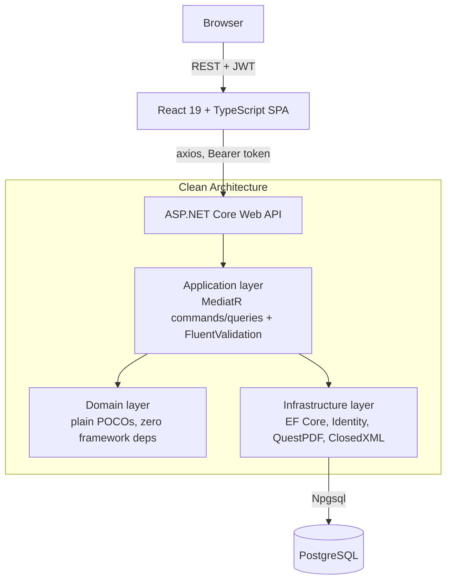
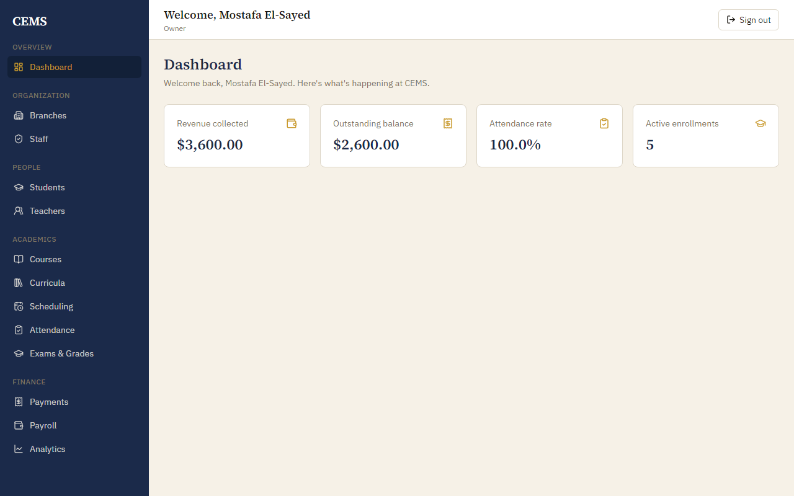
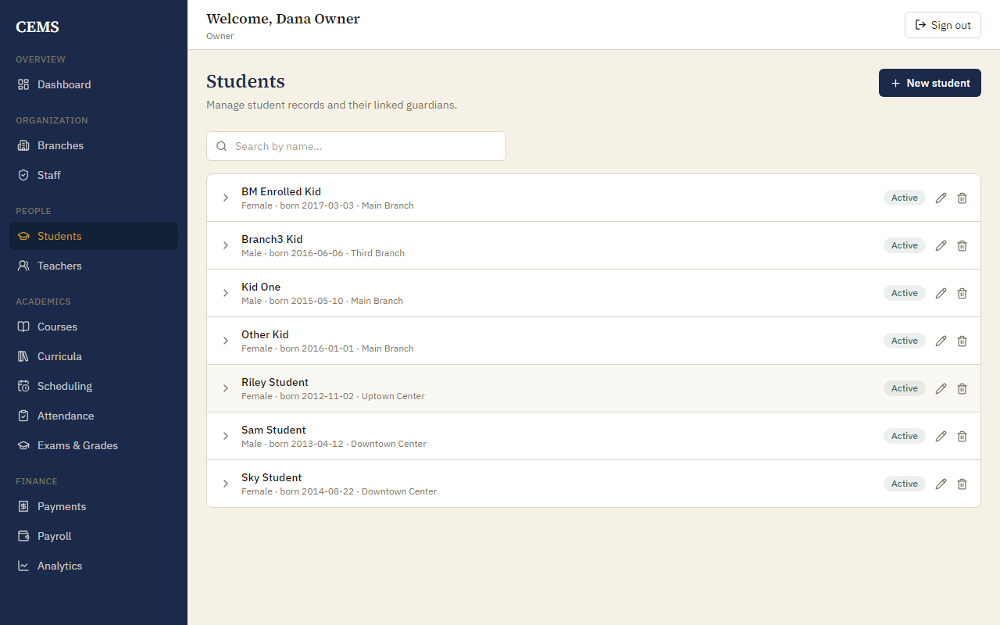
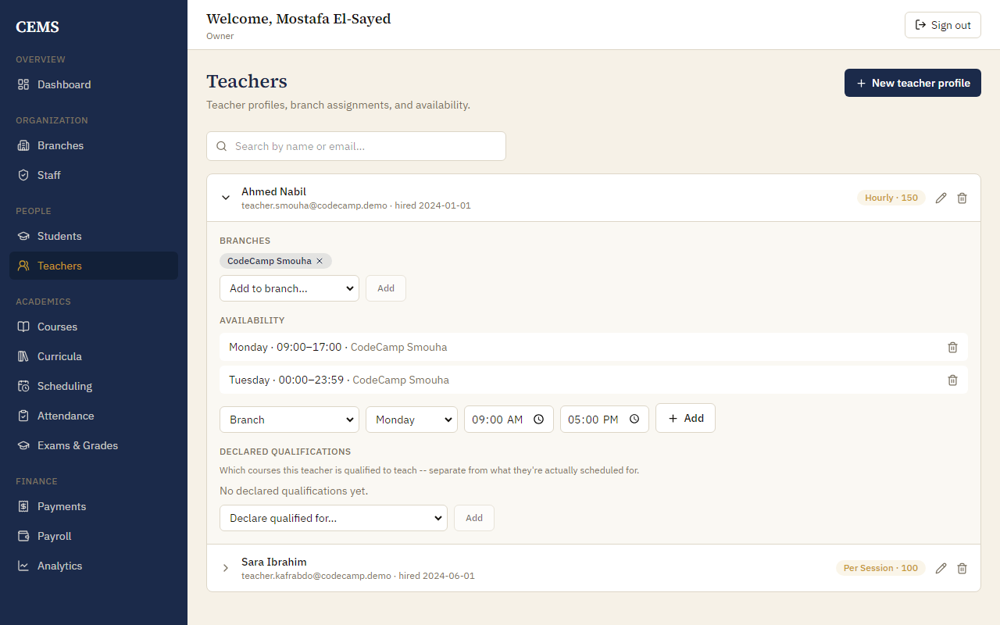
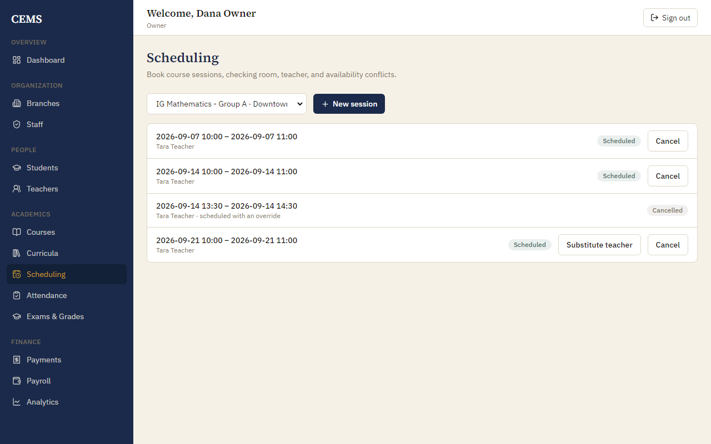
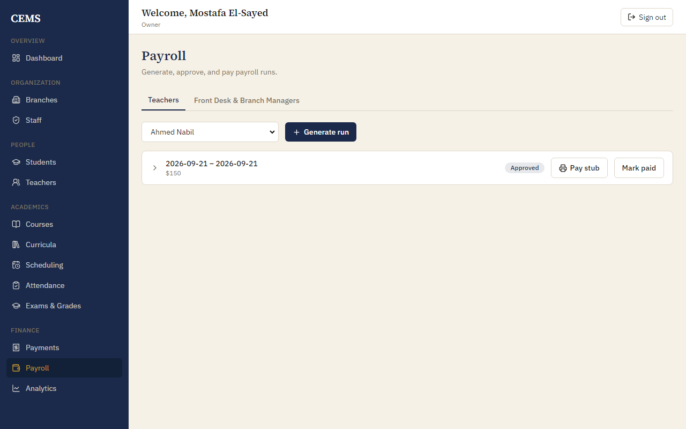
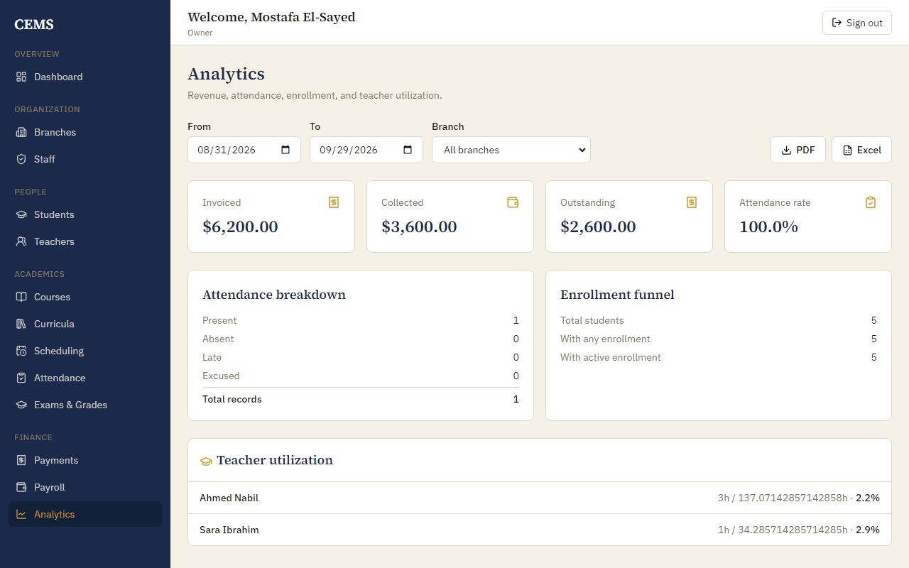
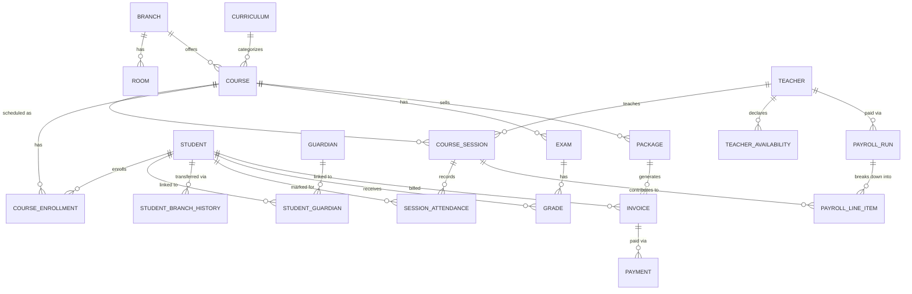

# CEMS

      [](https://github.com/alieldeenahmed/CEMS/actions/workflows/ci.yml)

A full-stack management system for a multi-branch educational center — branch-scoped authorization, concurrency-safe scheduling, and payroll/billing rules enforced by the database itself, not just by application code.

## Why I Built It

Most portfolio CRUD apps skip the problems that make backend engineering hard: who is allowed to see what, what happens when two requests race each other, and whether a calculation is provably correct rather than probably correct. CEMS is built around one real operating model — a business running several physical branches, with staff, teachers, and student data that must stay correctly scoped per branch and per role — specifically so those problems show up naturally instead of being contrived. I used it to practice enforcing authorization at the data-access layer instead of the UI, preventing double-bookings under genuine concurrent load with PostgreSQL rather than assuming requests won't collide, and treating billing and payroll as domains where "probably right" isn't good enough.

## Highlights

- **Multi-branch authorization** — every non-Owner request is scoped to the caller's own branch(es) inside the handler that touches the data, not filtered in the UI; verified by a test that probes every id-taking endpoint from the wrong branch and role and requires a 403/404.
- **Scheduling conflict prevention** — creating or reassigning a session checks room, teacher, and declared-availability conflicts, and separates structural violations (never overridable) from collisions a manager may knowingly override with a recorded reason.
- **Concurrency-safe booking** — two requests racing for the same room or teacher can't both win: PostgreSQL advisory locks serialize the check, and database exclusion constraints refuse an overlap even if a code path forgets to lock.
- **Database-enforced business rules** — positive amounts, ordered payroll periods, one live enrollment per student per course, no overlapping sessions or payroll periods — enforced as PostgreSQL constraints, not only application-level validation.
- **Payroll across four compensation models** — hourly, per-session, fixed salary, and percentage-of-revenue, computed as genuinely different code paths instead of one formula with a multiplier.
- **Billing with derived, not stored, state** — invoice status (`Pending → PartiallyPaid → Paid`) is recomputed from the sum of payments on every write; nothing ever sets it directly.
- **Audit logging without leaking secrets** — every state-changing command logs who did it and which record it targeted, by id only; passwords, tokens, and full payloads never reach a log line.
- **PDF/Excel reporting** — report cards, pay stubs, and analytics dashboards export as real PDFs (QuestPDF) and Excel workbooks (ClosedXML), not a client-side print dialog.

## Engineering Highlights

**Clean Architecture, strictly enforced.** A four-project backend (`CEMS.Domain → CEMS.Application → CEMS.Infrastructure → CEMS.Api`) with a one-way dependency rule: `Domain` has zero framework references — not even ASP.NET Identity, which lives in `Infrastructure` — so a domain entity that needs a user stores a plain `Guid`, never a navigation property. 114 endpoints across 16 controllers dispatch through MediatR to 114 command/query handlers, each with its own FluentValidation validator (34 validator classes).

**CQRS via MediatR, not a service-layer free-for-all.** Every write is a `Command`, every read is a `Query`, each with exactly one handler; cross-cutting concerns (input validation, audit logging) run once as pipeline behaviors instead of being copy-pasted into every handler.

**Concurrency-safe scheduling, proven under real load.** Booking a session is a check-then-write race: two simultaneous requests for the same room could both see it free and both succeed. CEMS closes that with PostgreSQL advisory locks (`pg_advisory_xact_lock`) taken in a fixed, sorted order, so two requests locking overlapping resources can never deadlock each other — and, as a backstop, `EXCLUDE USING gist` constraints make the database itself refuse two overlapping ordinary sessions even if a code path skips the lock. The same lock-then-check pattern protects payroll-period generation, invoice payments and cancellation, waitlist promotion, student transfers, and the one-time bootstrap of the first Owner account. Partial unique indexes (a `WHERE` clause on the index itself) enforce "one *live* enrollment per student per course" while still letting a dropped enrollment coexist — a rule a plain unique constraint can't express.

**Authorization backed by the database, not just the token.** A JWT proves who signed in, but the API re-reads the account on every request, so a deactivated account or a changed role takes effect immediately instead of waiting out the token's lifetime; the roles and branches used for every access check are the account's current ones.

**Concurrency testing against a real database, not a mock.** Beyond 483 fast, hermetic tests (SQLite in-memory), a dedicated PostgreSQL test project runs the real EF Core migrations against an empty database, checks the exclusion/unique/check constraints directly, and fires 8–12 simultaneous requests at the same booking, payment, or payroll-generation call to prove exactly one wins and the rest fail as a reported conflict — never silently corrupted data. These tests are built to be able to fail: removing the advisory locks (constraints still in place) failed 1 of the 10 scheduling-race tests; removing both the locks and the exclusion constraints failed 5 of 10.

**Verified numbers:** 525 backend tests (326 handler-level + 157 HTTP integration + 42 against PostgreSQL) and 264 frontend tests; about 98% backend and 99% frontend line coverage (92% branch), migrations excluded.

## Architecture


```mermaid
flowchart TD
    User[Browser] -->|REST + JWT| FE[React 19 + TypeScript SPA]
    FE -->|axios, Bearer token| API[ASP.NET Core Web API]
    subgraph Backend[Clean Architecture]
        API --> APP[Application layer<br/>MediatR commands/queries + FluentValidation]
        APP --> DOM[Domain layer<br/>plain POCOs, zero framework deps]
        APP --> INFRA[Infrastructure layer<br/>EF Core, Identity, QuestPDF, ClosedXML]
    end
    INFRA -->|Npgsql| DB[(PostgreSQL)]
```

Four backend projects with a strict one-way dependency (`Domain → Application → Infrastructure → Api`), plus a React 19/TypeScript SPA that talks to the API over REST with a JWT bearer token. The full entity-relationship diagram, module breakdown, and API surface are in [Technical Deep Dive](#technical-deep-dive) below.

## Testing

Tests run in three tiers of increasing realism:

1. **Fast, hermetic tests** (`CEMS.Application.Tests`, `CEMS.Api.Tests`) — 483 tests against a real EF Core context on SQLite in-memory: every handler, the full HTTP pipeline through `WebApplicationFactory`, an authorization snapshot of all 114 endpoints, and an access sweep that probes every endpoint from the wrong branch or role.
2. **PostgreSQL-specific tests** (`CEMS.Postgres.Tests`, 42 tests) — the real migrations applied to an empty database, the exclusion/unique/check constraints exercised directly, and `timestamptz`/`numeric` behavior SQLite can't reproduce. This project fails loudly — it does not skip — if no PostgreSQL server is reachable.
3. **Real concurrency tests**, inside the PostgreSQL suite — 8–12 simultaneous requests fired at the same booking, payment, or payroll endpoint to prove the database resolves the race correctly, not just that the happy path works.

**525 backend tests, 264 frontend tests, ~98%/~99% line coverage.** The full per-project breakdown, the bugs these tests found, and how to run the PostgreSQL suite locally are in [Technical Deep Dive](#technical-deep-dive).

## Screenshots

<table>
<tr>
<td width="50%"><br/><sub>Owner dashboard — revenue, attendance, and enrollment at a glance</sub></td>
<td width="50%"><br/><sub>Students — branch-scoped roster</sub></td>
</tr>
<tr>
<td width="50%"><br/><sub>Teacher profile — branch assignment, availability, declared qualifications</sub></td>
<td width="50%"><br/><sub>Scheduling — booked sessions with a live teacher substitution</sub></td>
</tr>
<tr>
<td width="50%"><br/><sub>Payroll — generated runs, draft and approved</sub></td>
<td width="50%"><br/><sub>Analytics — revenue, attendance, and teacher utilization</sub></td>
</tr>
</table>

## Getting Started

### Prerequisites
- .NET 9 SDK
- Node.js
- A local PostgreSQL instance

### Configuration

Connection string and JWT signing key are read from configuration and never committed. `Program.cs` fails fast at startup if the connection string is missing or the JWT settings are invalid (key under 32 bytes, missing issuer/audience, or an expiry outside 1 minute–24 hours). Set them locally with .NET's [Secret Manager](https://learn.microsoft.com/aspnet/core/security/app-secrets), from `Backend/src/CEMS.Api`:

```bash
dotnet user-secrets set "ConnectionStrings:Default" "Host=localhost;Port=5432;Database=cems;Username=postgres;Password=YOUR_PASSWORD"
dotnet user-secrets set "Jwt:Key" "<a long random string, at least 32 characters>"
```

Any other environment sets the same values as `ConnectionStrings__Default` / `Jwt__Key` environment variables instead — `IConfiguration` reads both the same way.

### Database

```bash
dotnet ef database update --project Backend/src/CEMS.Infrastructure --startup-project Backend/src/CEMS.Api
```

The migrations create the `btree_gist` extension and add overlap/uniqueness constraints; on a database that already contains rows that violate them (two ordinary sessions overlapping in one room, overlapping payroll periods, duplicate live enrollments) the migration fails and those rows must be resolved first.

There's no self-registration endpoint. The first account is created via `POST /api/auth/bootstrap-owner` (anonymous, but self-disables the instant any user exists):

```bash
curl -X POST https://localhost:7099/api/auth/bootstrap-owner \
  -H "Content-Type: application/json" \
  -d '{"email":"you@example.com","password":"YourPassword123","fullName":"Your Name","phoneNumber":"0100000000"}'
```

Every other account is created afterward via `POST /api/users/staff`.

### Running it

```bash
# Backend — https://localhost:7099 (and http://localhost:5272)
dotnet run --project Backend/src/CEMS.Api

# Frontend — http://localhost:5173
cd Frontend && npm install && npm run dev
```

### Demo data

`scripts/seed-demo-data.ps1` populates a fresh, empty `cems` database by driving the real running API end to end — every row passes through actual password hashing, RBAC, scheduling conflict checks, and payroll computation, not a raw SQL insert.

```powershell
./scripts/seed-demo-data.ps1
```

Prints every seeded account's email at the end (all passwords: `DemoPass123`).

## Project Status

Actively developed and demo-ready for local evaluation, with CI validating every push. This is a portfolio system, not a hardened production service; known limitations:

- Session scheduling assumes a single timezone across all branches; `TeacherAvailability` and session times are compared as literal UTC day-of-week/time-of-day, with no per-branch timezone handling, and an availability window can't describe a session that crosses midnight
- JWTs last 6 hours with no refresh token — a hard logout at expiry, not a silent renewal — and the per-request account check adds a few database reads to every authenticated call
- No email integration: password resets are admin-assisted rather than self-service, and there are no invoice-due reminders
- Logging goes through the standard `ILogger` to the console only — there is no log sink, metrics, or tracing backend configured
- Percentage-based teacher payroll pays each teacher of a course their percentage of that course's full collected revenue (co-teachers each get a share of the same money), and still counts payments on invoices that were later cancelled while partly paid
- The Owner-only payroll handlers rely on the controller's `[Authorize(Roles = "Owner")]` (pinned by the endpoint snapshot) rather than re-checking the role inside the handler
- A front-desk user can delete a student, but only one with no enrollments, attendance, grades, or invoices; anyone with history must be set to Paused or Graduated instead
- Deactivating a user takes effect on their next request, but there is no "sign out everywhere" or per-device session list

## Technical Deep Dive

The sections above are enough to see what the system does and how it's engineered. Everything below is for someone who wants to read the actual design decisions.

### Domain & Business Logic

The interesting part of this system isn't the entities — it's the rules layered on top of them.

**Scheduling conflicts** are computed, not stored: `CreateSessionCommandHandler` runs three independent checks (room, teacher, teacher-availability) against `CourseSession` and `TeacherAvailability` on every create, under a per-room/per-teacher advisory lock, distinguishes which conflicts are structurally impossible to override (including a teacher who isn't qualified for the course) from which can be overridden by an Owner/BranchManager with a recorded reason, and persists that decision (`Overridden`, `OverrideReason`, `OverriddenByUserId`) on the session for audit purposes. A detected, non-overridden conflict throws a dedicated `SchedulingConflictException`, mapped to `409 Conflict` with the specific conflict list — distinct from a generic `400`, so the frontend can tell "this input was invalid" from "this input is valid but collides with something."

**Branch isolation** isn't a query filter bolted onto the DbContext — it's an explicit check (`EnsureAccessToBranch`) inside each handler that touches branch-owned data, which lets a handler apply different logic depending on *why* access is being checked: `ResetStaffPasswordCommandHandler`, for instance, resolves a Teacher's branch from `TeacherBranch` specifically, because `UserBranchAssignment` (used for BranchManager/FrontDesk) is always empty for a Teacher — a distinction covered by its own regression test.

**Payroll** models compensation as a discriminated calculation, not a single formula: two of the four `PayType`s (Hourly, PerSession) build a list of `PayrollLineItem`s from actual `CourseSession` rows in the period; the other two (Fixed, Percentage) compute a total with no session loop at all, because a flat salary and a percentage of collected revenue don't have "line items" in any meaningful sense. Each hourly/per-session line is rounded to the cent before summing, so the run's total always equals the sum of its line items.

**Invoice/payment state** is derived, not set: recording a `Payment` re-sums every payment against the invoice on every write and recomputes `Pending → PartiallyPaid → Paid` from that sum — there's no code path that lets a client set an invoice's status directly.

**Time is stored as UTC, deliberately.** `ApplicationDbContext` applies a global EF Core `ValueConverter` that normalizes every `DateTime` to `DateTimeKind.Utc`, since Npgsql rejects `Kind=Unspecified` for `timestamptz` columns and a JSON timestamp without a `Z` suffix otherwise comes back unspecified — the converter keeps the API correct even when a client forgets the suffix.

### Database Design

PostgreSQL via EF Core 9 / Npgsql, 18 migrations, 24 domain entities across modules that mirror the business (Branches, Students, Teachers, Courses, Attendance, Exams, Payments, Payroll). Beyond primary keys, the database enforces invariants directly: one attendance record per student per session, one grade per student per exam, one teacher profile per user, one *live* (active or waitlisted) enrollment per student per course via a partial unique index (a dropped one may coexist, which is how re-enrolling works), unique waitlist positions per course, `EXCLUDE USING gist` constraints that stop overlapping ordinary sessions for a room or teacher and overlapping payroll periods for a teacher or staff member, and check constraints for positive amounts, ordered periods, and end-after-start sessions.


```mermaid
erDiagram
    BRANCH ||--o{ ROOM : has
    BRANCH ||--o{ COURSE : offers
    CURRICULUM ||--o{ COURSE : categorizes
    COURSE ||--o{ COURSE_SESSION : "scheduled as"
    COURSE ||--o{ COURSE_ENROLLMENT : has
    STUDENT ||--o{ COURSE_ENROLLMENT : enrolls
    STUDENT ||--o{ STUDENT_GUARDIAN : "linked to"
    GUARDIAN ||--o{ STUDENT_GUARDIAN : "linked to"
    STUDENT ||--o{ STUDENT_BRANCH_HISTORY : "transferred via"
    TEACHER ||--o{ COURSE_SESSION : teaches
    TEACHER ||--o{ TEACHER_AVAILABILITY : declares
    COURSE_SESSION ||--o{ SESSION_ATTENDANCE : records
    STUDENT ||--o{ SESSION_ATTENDANCE : "marked for"
    COURSE ||--o{ EXAM : has
    EXAM ||--o{ GRADE : has
    STUDENT ||--o{ GRADE : receives
    STUDENT ||--o{ INVOICE : billed
    COURSE ||--o{ PACKAGE : sells
    PACKAGE ||--o{ INVOICE : generates
    INVOICE ||--o{ PAYMENT : "paid via"
    TEACHER ||--o{ PAYROLL_RUN : "paid via"
    PAYROLL_RUN ||--o{ PAYROLL_LINE_ITEM : "breaks down into"
    COURSE_SESSION ||--o{ PAYROLL_LINE_ITEM : "contributes to"
```

### API Surface

16 controllers, 114 endpoints. Grouped by domain:

| Area | Endpoints | Representative examples |
|---|---|---|
| Auth | 2 | `POST /api/auth/login`, `POST /api/auth/bootstrap-owner` (self-disables once any user exists) |
| Students & Guardians | 21 | CRUD, `POST /students/{id}/transfer-branch`, `GET /students/{id}/branch-history`, `GET /students/{id}/report-card`, invoices, balance |
| Teachers | 19 | CRUD, branch assignment, availability, declared qualifications, `GET /teachers/my-schedule`, payroll runs |
| Branches & Rooms | 10 | CRUD branches, CRUD rooms per branch |
| Courses & Curricula | 15 | CRUD, enrollments, waitlist promotion, packages |
| Scheduling | 7 | create/cancel session, `POST /sessions/{id}/substitute-teacher`, attendance |
| Exams & Grades | 7 | CRUD exams, record/view grades |
| Billing | 9 | invoices, `POST /invoices/{id}/payments`, packages |
| Payroll | 9 | generate/approve/mark-paid runs, pay stub PDF, staff payroll runs |
| Analytics | 7 | revenue, attendance trends, enrollment funnel, teacher utilization, PDF/Excel export |
| Staff/Users | 8 | staff CRUD, branch-scoped staff list, password reset |

Swagger/OpenAPI UI is available at `/swagger` in the Development environment, with JWT bearer auth wired into the Swagger security scheme.

### Frontend

React 19 + TypeScript, built with Vite. Routing is `react-router-dom`, with a `ProtectedRoute` component gating authenticated routes and redirecting to `/login`; the nav itself (`app/nav.ts`) is role-filtered, so a role that can't call an endpoint doesn't see the page for it — the real enforcement stays server-side.

- **Data fetching**: TanStack Query for every server read/write, with query invalidation on mutation — no separate global store
- **Forms**: React Hook Form + Zod schemas, including cross-field validation (e.g. the create-student guardian rule, a percentage-pay-rate-≤100 refinement that doesn't apply to Hourly)
- **API client**: a single `axios` instance that attaches the JWT bearer token on every request and clears it on a `401`
- **Structure**: `features/` folders mirror the backend's `Application` module breakdown 1:1; `shared/ui/` holds hand-built primitives (Button, Input, Select, Modal, PageHeader, StatCard, SearchInput) — no external component library
- **Role-aware UI**: pages read the current user's roles to conditionally show admin-only actions (e.g. only an Owner sees the edit/delete controls on a teacher profile)

### Testing in Depth

**Backend — three xUnit projects, no mocking library.**

| Project | Tests | Database | What it exercises |
|---|---|---|---|
| `CEMS.Application.Tests` | 326 | SQLite in-memory | Every command/query handler family against a real `ApplicationDbContext`, with hand-written fakes for `ICurrentUserService`/`IIdentityService`. Includes the real MediatR pipeline (validation + audit logging), the real ASP.NET Identity/JWT code, and the real QuestPDF/ClosedXML generators. |
| `CEMS.Api.Tests` | 157 | SQLite in-memory | The whole HTTP stack through `WebApplicationFactory<Program>`: routing, JWT auth, model binding, exception-to-status mapping, multi-step workflows (enroll → invoice → pay → payroll, waitlist promotion, substitution, password reset), and assertions on what is written to the logs. |
| `CEMS.Postgres.Tests` | 42 | **PostgreSQL** | Every migration applied to an empty database (and the model checked for un-migrated changes), the exclusion/unique/check constraints, advisory locks, `timestamptz`/`numeric` behavior, and genuinely concurrent requests released at the same instant against a real server. |

Three suites do most of the security work:

- **Authorization snapshot** (`authorization-surface.txt`) — a reflected list of all 114 endpoints with their `[Authorize]` roles. Any endpoint added, removed, or re-permissioned fails the test until the diff is reviewed and the snapshot regenerated.
- **Access sweep** — fires a request at every route that takes another resource's id, as a signed-in user who must not reach it (staff of another branch, a teacher reaching for another teacher's course), and requires 403/404 for all of them.
- **Role × endpoint matrix and branch-isolation tests** — the same idea from the other direction, per role.

**How the concurrency tests were checked to be meaningful.** Removing the PostgreSQL advisory locks (constraints still active) failed 1 of the 10 scheduling-race tests; removing both the locks and the `EXCLUDE USING gist` constraints failed 5 of 10. A test suite that passes identically whether or not the protection exists wouldn't be proving anything.

**Running the tests:**

```bash
dotnet test Backend/CEMS.sln                                       # everything (needs PostgreSQL, see below)
dotnet test Backend/CEMS.sln --filter "FullyQualifiedName!~CEMS.Postgres.Tests"   # the fast, hermetic suites only
cd Frontend && npm run test:coverage
```

`CEMS.Postgres.Tests` needs a PostgreSQL server whose role may `CREATE DATABASE`. It creates a throwaway database per test class and drops it afterward, and it **fails, rather than skips**, if no server is reachable. It looks for the server in `CEMS_TEST_POSTGRES` (a normal Npgsql connection string), and otherwise reuses the API's own `dotnet user-secrets` connection (host and credentials only). With Docker:

```bash
docker run -d --name cems-pg -e POSTGRES_PASSWORD=postgres -p 5432:5432 postgres:16
export CEMS_TEST_POSTGRES="Host=localhost;Username=postgres;Password=postgres"
```

**Bugs these tests found**, all fixed with a regression test:

- `RecordPaymentCommandHandler` counted each new payment twice, so a payment over half an invoice marked it fully paid.
- Guardians were readable and editable across branches; visibility is now derived from the guardian's students' branches.
- Deleting a student, room, or teacher with history hit a foreign-key error and returned a 500; each now returns a 400 with a reason.
- Attendance could be marked on a cancelled session; admin password reset removed the old password before validating the new one against the policy.
- **Concurrency:** two simultaneous bookings of one room or teacher both succeeded; two simultaneous first-time setups created two Owners; two payments racing on one invoice could overpay it or leave the wrong status; six students enrolling at once could overfill a one-seat course; two payroll runs for the same teacher and period could both be created; an amount edit could land on a payroll run that had just been approved.
- **Atomicity:** creating a staff member wrote the account, its role, and its branch assignment as separate commits, so a failure part-way left a login with no branch and an "email already taken" error on retry.
- **Business rules that only the UI enforced:** a payment could exceed the invoice balance or be dated in the future; money with a third decimal place was validated, used in calculations, then silently rounded by the column; an overnight session slipped past the availability check; a substitution wiped an earlier override record; a waitlisted student could be promoted into a full course; a student could be transferred while still enrolled at the old branch; a package from another branch could be used to invoice a student.

### CI/CD

GitHub Actions (`.github/workflows/ci.yml`) runs on every push to `main` and on every pull request, as two parallel jobs:

| Job | Steps |
|---|---|
| Backend | `dotnet restore` → `dotnet build` (Release, whole solution) → `dotnet test` (all three test projects, against a PostgreSQL service container) |
| Frontend | `npm ci` → `npm run lint` (oxlint) → `npm run test:coverage` (Vitest, fails below a 90% coverage floor) → `npm run build` (`tsc -b` + Vite) |

There is no deployment step — the pipeline validates, it doesn't ship.

### Engineering Decisions & Trade-offs

**Branch isolation is a convention, backed by tests — not a global filter.** Each handler that touches branch-owned data calls `EnsureAccessToBranch` (or `VisibleTo` for guardians, which have no branch of their own) as soon as it knows the record's branch. A global EF query filter would be harder to forget but cannot express "a teacher's branch comes from `TeacherBranch`, a manager's from `UserBranchAssignment`." The cost of a convention is that it can be forgotten, so it's enforced from outside: the endpoint snapshot fails on any change to who may call what, and the access sweep tries every id-taking route as someone who must not reach it.

**Concurrency: advisory locks first, exclusion constraints behind them.** "Is the room free? then book it" is a race, and `SERIALIZABLE` would mean retry loops on every write path. Instead the handler opens a transaction and takes `pg_advisory_xact_lock` on the room and the teacher (in sorted order, so two requests can't deadlock), and only then checks — the second request waits, then sees the first one's session. Row locks can't do this because the conflicting row doesn't exist yet. Behind the locks, `EXCLUDE USING gist` constraints make the database itself refuse two ordinary sessions that overlap in a room or for a teacher, so a code path that forgets the lock still can't corrupt the timetable. Sessions a manager has knowingly overridden are exempt from the constraint (that's what an override is) and carry their reason on the row. The same mechanism serializes enrolling/promoting per course, payments and cancellation per invoice, payroll generation and approval, student transfers, and the one-time Owner bootstrap; unique indexes and payroll-period exclusion constraints are the backstop for those.

**Transactions where the operation is genuinely atomic, not everywhere.** A single `SaveChangesAsync` is already atomic, so most handlers have no explicit transaction. Explicit ones exist only where more than one write or a lock is involved: session booking, enrollment, payments, payroll, transfers, and creating a staff member (Identity account + role + branch assignment share one `DbContext`, so one transaction covers all three).

**Teacher qualification is structural, not overridable.** A conflict (double-booking, outside availability) is something a manager may knowingly accept; an unqualified teacher is not a scheduling collision but a staffing fact, like a teacher who isn't assigned to the branch. The trade-off is that emergency cover needs the qualification added first, rather than an override reason.

**The JWT proves identity; the account decides access.** Tokens last up to 6 hours with no refresh flow, so on their own a deactivated account or a changed role would linger for hours. Rather than build a revocation list, every request re-reads the account and rejects it if it's gone or deactivated, rebuilding the role and branch claims from the database. Five failed passwords lock an account for 15 minutes; a locked account answers exactly like a wrong password, at the cost that someone who knows an address can lock that account out.

**Logging is narrow by construction.** Each successful command writes one audit line: who, which command, which records (the values of its `Guid` properties and nothing else, so passwords, emails, and amounts cannot reach a log even by mistake), and a trace id. A failed request is logged once, at the HTTP layer, at a level that means something: `Warning` for 401/403, `Information` for other client errors, `Error` with the exception for a 500.

**Money is validated to what the column can hold.** Amounts are `numeric(10,2)`; validators reject a third decimal place or an overflow up front, payroll rounds each line half-away-from-zero so totals equal the sum of their lines, and check constraints repeat the basics (positive amounts, ordered periods) in the database.

**Two databases in the tests, on purpose.** SQLite in-memory keeps 483 tests to seconds and lets every test start from an empty database; PostgreSQL is used only for what SQLite cannot show, and those tests fail rather than skip when no server is available.

**The Application layer talks to EF Core directly.** `IApplicationDbContext` exposes `DbSet`s and handlers query them; there is no repository layer on top. That's a deliberate simplification — a repository over EF would mostly rename `Where` — paid for by the Application project depending on EF Core, and it's why the tests run handlers against a real context rather than mocks.

**Some behaviors that look like gaps are decisions.** Teachers are shared across branches, so a Branch Manager may attach any teacher to *their own* branch (they cannot touch another branch). The front desk is not sent teacher pay. A payment may not exceed the remaining balance (there is no customer-credit model), and may not be future-dated.

### Project Structure

```text
CEMS/
├── Backend/
│   ├── src/
│   │   ├── CEMS.Domain/          # Entities, enums — no framework dependencies
│   │   ├── CEMS.Application/     # MediatR commands/queries, validators, DTOs, interfaces
│   │   ├── CEMS.Infrastructure/  # EF Core, Identity, Postgres, QuestPDF, ClosedXML
│   │   └── CEMS.Api/             # Controllers, JWT/CORS/Swagger setup, exception handling
│   └── tests/
│       ├── CEMS.Application.Tests/   # Handler, pipeline, Identity/JWT, report tests (SQLite)
│       ├── CEMS.Api.Tests/           # HTTP integration, authorization snapshot, access sweep (SQLite)
│       └── CEMS.Postgres.Tests/      # Real PostgreSQL: migrations, constraints, locks, concurrency
├── .github/workflows/            # CI: backend build+test, frontend lint+test+build
├── Frontend/
│   └── src/
│       ├── features/             # One folder per domain module, mirrors Application/
│       ├── shared/                # API client, hand-built UI primitives
│       └── app/                  # Routing, nav, auth context
├── docs/screenshots/
├── scripts/                      # Local backup/restore, demo data seeder
└── README.md
```

### Tech Stack

| Layer | Technology |
|---|---|
| Backend | ASP.NET Core Web API (.NET 9) |
| Language | C# |
| Architecture | Clean Architecture (Domain → Application → Infrastructure → Api) |
| Application layer | CQRS via MediatR, FluentValidation |
| ORM | Entity Framework Core 9 (Npgsql provider) |
| Database | PostgreSQL |
| Auth | ASP.NET Identity + JWT Bearer |
| Docs | Swagger / OpenAPI (Development only) |
| PDF export | QuestPDF |
| Excel export | ClosedXML |
| Backend testing | xUnit; SQLite in-memory for speed, PostgreSQL for what SQLite can't show |
| Frontend | React 19, TypeScript |
| Build tool | Vite |
| Styling | Tailwind CSS v4 |
| Data fetching | TanStack Query |
| Forms/validation | React Hook Form + Zod |
| Routing | React Router |
| Frontend testing | Vitest, React Testing Library |
| Linting | oxlint |

## License

Licensed under the [MIT License](LICENSE).
